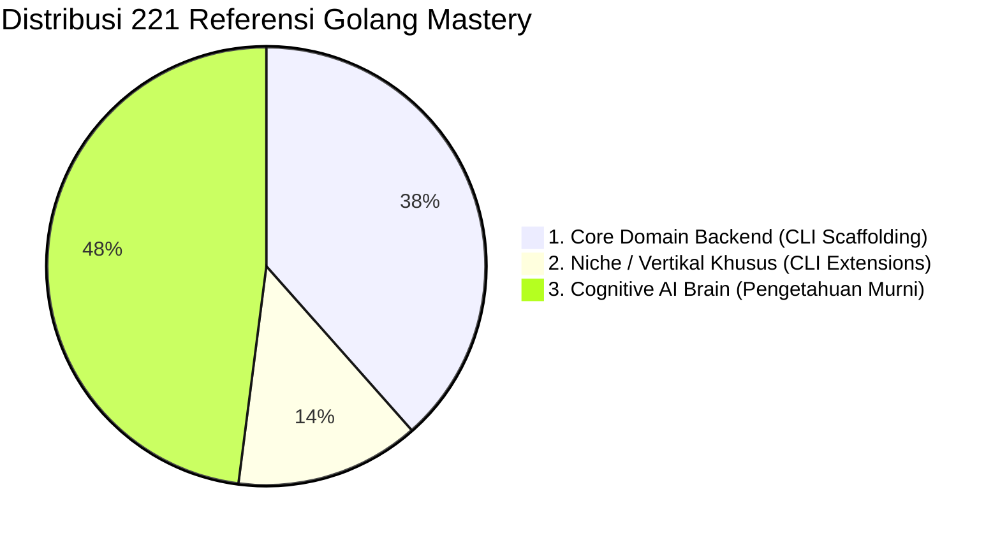

# 🏛️ Master Taxonomy: Golang Core vs. Niche vs. Cognitive AI Brain

> **Dokumen Resmi**: `docs/GO_AETHER_TAXONOMY_AND_ROADMAP.md`  
> **Versi Basis**: `go-aether v0.8.6`  
> **Auditor**: Aetheris L8 Principal Engineer  
> **Tujuan**: Menetapkan batas tegas antara apa yang WAJIB menjadi CLI command, apa yang berstatus Niche, dan apa yang HANYA menjadi 'otak' pengetahuan AI tanpa dijadikan command.

---

## 🧭 1. Tiga Pilar Klasifikasi Domain

1. **Pilar 1: Core Domain Backend (Wajib Jadi CLI Command)**: Komponen dan pola repetitif yang 99% pasti disentuh di setiap proyek backend Go performa tinggi (Hexagonal, DDD, SQLC/DB, Concurrency Pipelines, gRPC/REST, Observability, Native QA).
2. **Pilar 2: Niche / Vertikal Khusus (CLI Extensions)**: Komponen khusus industri spesifik (Fintech, IoT, Video Calling WebRTC, Telecom, GenAI) yang memperkaya `go-aether` untuk use-case tingkat lanjut.
3. **Pilar 3: Cognitive AI Brain (Hanya untuk Pengetahuan AI)**: Teori internal runtime Go, compiler internals, ilmu merakit database engine (Raft/LSM), dan SOP engineering yang memandu AI menghasilkan kode berkualitas L8, tanpa perlu dibuatkan CLI command.

---

## 📦 PILAR 1: CORE DOMAIN GOLANG (CLI COMMANDS)

### A. Core Command yang SUDAH SELESAI (Aktif di `v0.8.6`) ✅

| Domain Core | Command CLI | Berkas Output / Komponen yang Digenerate | Berkas Referensi Terkait |
| :--- | :--- | :--- | :--- |
| **Tactical DDD & Hexagonal** | `init [name]` | `aether.yaml`, layout direktori, DB driver | `arch_patterns/clean_hexagonal_architecture.md` |
| | `ls` | Inspeksi modul domain & plugin terpasang | `cli_tooling/cobra_command_architecture.md` |
| | `make:module [name]` | Domain, Repository, Service, HTTP Handler slice | `arch_patterns/modular_monolith_go.md` |
| | `make:service [name]` | Business use-case orchestrator | `arch_patterns/clean_hexagonal_architecture.md` |
| | `make:handler [name]` | HTTP (Chi/Gin/Echo/Fiber) / gRPC transport | `microservices_grpc/rest_chi_middleware_stack.md` |
| | `make:domain [name]` | Pure domain struct entity | `arch_patterns/ddd_aggregate_repository.md` |
| | `make:port [name]` | Inbound / Outbound interface contracts | `arch_patterns/clean_hexagonal_architecture.md` |
| | `make:repository [name]` | Persistence repository adapter | `arch_patterns/ddd_aggregate_repository.md` |
| | `make:valueobject [name]` | Immutable Value Object & parser | `arch_patterns/ddd_aggregate_repository.md` |
| | `make:aggregate [name]` | DDD Aggregate Root + event recorder | `arch_patterns/ddd_aggregate_repository.md` |
| | `make:event [name]` | Domain Event struct & JSON serializer | `arch_patterns/event_driven_pubsub.md` |
| | `make:command [name]` | CQRS Command DTO & execution handler | `arch_patterns/cqrs_event_sourcing_impl.md` |
| | `make:query [name]` | CQRS Query DTO & read-model handler | `arch_patterns/cqrs_event_sourcing_impl.md` |
| **Database & Persistence** | `make:migration [name]` | Pasangan SQL migration (Goose / Migrate) | `db_sqlc/database_migration_go.md` |
| | `make:seeder [name]` | Deterministic database dummy seeder | `db_sqlc/acid_transactions_isolation.md` |
| **Ecosystem & Middlewares** | `add:middleware` | CORS, Recovery, RequestID, Timeout | `security_owasp/web_security_headers.md` |
| | `add:logger` | Zero-allocation Zerolog / Slog logger | `observability_resilience/structured_logging_zerolog.md` |
| | `add:config` | Viper configuration precedence (.env/YAML) | `cli_tooling/config_precedence_viper.md` |
| | `add:auth` | JWT Dual Token auth (Access + Refresh) | `security_owasp/jwt_dual_token_auth.md` |
| | `add:crypto` | AES-256-GCM AEAD encryption helpers | `security_owasp/aes_gcm_cryptography.md` |
| **Caching & Storage** | `add:cache` | Redis connection pool & cache-aside | `caching_strategy/redis_advanced_patterns.md` |
| | `add:multilevelcache` | L1 In-Memory + L2 Redis invalidator | `caching_strategy/multilevel_cache_l1l2.md` |
| | `add:s3 [minio\|aws]` | Multi-part S3 client & pre-signed URL | `cloud_provider_sdk/cloud_storage_patterns.md` |
| | `add:storage` | Local filesystem & S3 abstract driver | `cloud_provider_sdk/cloud_storage_patterns.md` |
| **Observability & Cloud** | `add:telemetry` | OpenTelemetry distributed tracer | `observability_resilience/opentelemetry_tracing.md` |
| | `add:profiling` | pprof / Pyroscope continuous profiler | `observability_resilience/continuous_profiling.md` |
| | `add:healthcheck` | Liveness & Readiness probe endpoints | `observability_resilience/health_check_readiness.md` |
| | `add:docker` | Multi-stage distroless Dockerfile | `devops_control_planes/docker_container_go.md` |
| | `add:k8s` | Deployment, Service, HPA manifests | `devops_control_planes/kubernetes_deployment_go.md` |
| | `add:ci [github\|gitlab]` | Automated test, lint & build CI pipeline | `ci_cd_pipeline/github_actions_go.md` |
| **Async & Messaging** | `add:worker` | Asynq / River queue worker | `background_jobs_worker/asynq_redis_jobs.md` |
| | `add:cron` | Scheduled cron job runner | `background_jobs_worker/cron_scheduler_go.md` |
| | `add:outbox` | Transactional outbox event publisher | `distributed_patterns_resilience/outbox_pattern_transactional.md` |
| | `add:lock` | Redis distributed Redlock | `concurrency/distributed_locks_redis.md` |
| | `add:resilience` | Circuit Breaker & Bulkhead limiter | `observability_resilience/circuit_breaker_hystrix.md` |
| | `add:search` | Meilisearch / Elasticsearch client | `ai_data_infra/pgvector_similarity_search.md` |
| | `add:mailer` | SMTP / Sendgrid transactional mailer | `media_asset_pipeline/excelize_streaming_million_rows.md` |
| | `add:websocket` | Gorilla / Nhooyr WebSocket pool hub | `realtime_networking/websocket_gnet_epoll.md` |
| | `add:sse` | Server-Sent Events unidirectional broker | `microservices_grpc/grpc_streaming_patterns.md` |

---

### B. Core Command yang AKAN DIBUAT (Gap Penutup) 🚀

| Domain Core | Command Usulan | Berkas Output yang Digenerate | Target Berkas Template & Referensi |
| :--- | :--- | :--- | :--- |
| **Testing & Quality (Fase 13)** | `test:stress [k6\|vegeta]` | `tests/stress/load_test.js` | `templates/tests/k6_stress.js.tmpl` (`testing_quality/benchmarking_pprof.md`) |
| | `test:chaos` | `pkg/middleware/chaos.go` | `templates/plugins/chaos.go.tmpl` (`observability_resilience/circuit_breaker_hystrix.md`) |
| | `test:fuzz` | `tests/fuzz/fuzz_test.go` | `templates/tests/fuzz.go.tmpl` (`testing_quality/fuzz_testing_go.md`) |
| | `test:mutation` | `scripts/mutation_test.ps1` | `templates/tests/mutation.tmpl` (`testing_quality/unit_testing_testify.md`) |
| | `test:benchmark` | `tests/bench/alloc_test.go` | `templates/tests/benchmark.go.tmpl` (`testing_quality/benchmarking_pprof.md`) |
| | `test:container` | `tests/integration/testcontainer_test.go` | `templates/tests/testcontainers.go.tmpl` (`testing_quality/testcontainers_integration.md`) |
| **Enterprise SQLC & gRPC (Fase 14)** | `add:sqlc` | `sqlc.yaml`, `db/queries/*.sql` | `templates/plugins/sqlc.yaml.tmpl` (`db_sqlc/sqlc_pgx_driver.md`) |
| | `make:proto [name]` | `proto/v1/[name].proto`, `buf.yaml` | `templates/core/proto.tmpl` (`microservices_grpc/grpc_protobuf_patterns.md`) |
| | `add:grpc-gateway` | `internal/adapter/gateway/gateway.go` | `templates/plugins/grpc_gateway.go.tmpl` (`microservices_grpc/rest_chi_middleware_stack.md`) |
| | `add:graphql [gqlgen]` | `graph/schema.graphqls`, `graph/resolver.go` | `templates/plugins/graphql.go.tmpl` (`microservices_grpc/graphql_gqlgen_dataloader.md`) |
| | `add:readreplica` | `pkg/database/replica_pool.go` | `templates/plugins/read_replica.go.tmpl` (`db_sqlc/read_replica_routing.md`) |
| | `make:cursor-paginator` | `pkg/pagination/cursor.go` | `templates/plugins/cursor_paginator.go.tmpl` (`microservices_grpc/pagination_patterns.md`) |
| **Concurrency & Pipeline (Fase 15)** | `make:pipeline [name]` | `pkg/pipeline/[name]_pipeline.go` | `templates/core/pipeline.go.tmpl` (`concurrency/channel_patterns_pipelines.md`) |
| | `add:singleflight` | `pkg/cache/singleflight.go` | `templates/plugins/singleflight.go.tmpl` (`concurrency/singleflight_thundering_herd.md`) |
| | `add:metrics [prometheus]` | `pkg/metrics/prometheus.go` | `templates/plugins/prometheus.go.tmpl` (`observability_resilience/prometheus_metrics_red.md`) |
| | `add:drain` | `pkg/lifecycle/drain.go` | `templates/plugins/drain.go.tmpl` (`observability_resilience/graceful_shutdown_drain.md`) |

---

## 🎯 PILAR 2: NICHE / VERTIKAL KHUSUS (CLI EXTENSIONS)

Command ini sudah aktif atau opsional untuk vertikal industri spesifik:

| Kategori Niche | Command CLI | Keterangan & Use Case Spesifik | Status |
| :--- | :--- | :--- | :--- |
| **Fintech & Perbankan** | `add:ledger` | Double-Entry Bookkeeping Ledger (Debit/Kredit balance check) | ✅ Selesai (`v0.8.3`) |
| | `add:decimal` | High-precision arbitrary precision financial math | ✅ Selesai (`v0.8.3`) |
| | `add:reconciliation` | Bank statement reconciliation matching engine | ✅ Selesai (`v0.8.3`) |
| | `add:pricing-engine` | Rule-based tiered transaction rate card & fee matrix | ✅ Selesai (`v0.8.3`) |
| | `add:idempotency` | Distributed idempotency keys anti double-charge | ✅ Selesai (`v0.8.0`) |
| **Realtime IoT & WebRTC** | `add:webrtc [pion]` | Pion WebRTC peer-to-peer data channels & video signaling | ✅ Selesai (`v0.8.5`) |
| | `add:mqtt [paho]` | Paho MQTT 3.1.1/5.0 client untuk telemetri sensor IoT | ✅ Selesai (`v0.8.5`) |
| **Vendor SaaS & Messaging** | `add:twilio` | Twilio REST API SMS & WhatsApp OTP messaging | ✅ Selesai (`v0.8.5`) |
| | `add:firebase` | Firebase Cloud Messaging mobile push notification SDK | ✅ Selesai (`v0.8.0`) |
| | `add:ai [provider]` | OpenAI, Anthropic, Gemini, Ollama GenAI client | ✅ Selesai (`v0.4.0`) |
| **Enterprise Scale-Out** | `add:saga` | Distributed Sagas Orchestration lintas microservices | ✅ Selesai (`v0.7.0`) |
| | `add:multitenancy` | Tenant data isolation (Schema per Tenant / Column) | ✅ Selesai (`v0.7.0`) |
| | `add:discovery` | HashiCorp Consul / mDNS service discovery client | ✅ Selesai (`v0.7.0`) |
| | `add:featureflags` | Dynamic percentage rollout toggles (LaunchDarkly) | ✅ Selesai (`v0.8.2`) |
| | `add:secrets` | HashiCorp Vault dynamic secret lease renewal | ✅ Selesai (`v0.8.1`) |
| | `add:authz` | Casbin dynamic RBAC/ABAC policy engine | ✅ Selesai (`v0.8.2`) |
| | `add:bloomfilter` | Probabilistic filter anti cache penetration | ✅ Selesai (`v0.8.6`) |
| **Dokumen & Media (Wave 3)**| `add:pdf [chromedp]` | Headless Chrome pixel-perfect PDF generator | ⏳ Wave 3 Usulan |
| | `add:excel [excelize]` | Streaming Excel generator 1M baris (<20MB RAM) | ⏳ Wave 3 Usulan |
| | `add:i18n` | `golang.org/x/text` dynamic hot-reload localization | ⏳ Wave 3 Usulan |

---

## 🧠 PILAR 3: COGNITIVE AI BRAIN (HANYA UNTUK PENGETAHUAN AI)

Domain ini **TIDAK DIBUATKAN CLI COMMAND** karena merupakan ilmu internal runtime, compiler, atau SOP manusiawi yang memandu AI dalam menulis kode secara presisi:

| Domain | Total Berkas | Alasan Mutlak TIDAK Dibuatkan CLI Command | Berkas Contoh |
| :--- | :---: | :--- | :--- |
| **`runtime_internals`** | 12 files | **Internal Mesin Go:** Cara kerja GMP Scheduler, Tri-Color Garbage Collector, Escape Analysis, Stack Growth, Memory Arenas, PGO, dan Pointer Unsafe. AI memakai ilmu ini agar setiap kode yang ditulis bebas leak dan efisien alokasi memori. | `gmp_scheduler.md`, `gc_mark_sweep_internals.md`, `escape_analysis_pprof.md` |
| **`distributed_consensus_storage`** | 8 files | **Ilmu Merakit Mesin Database:** Algoritma Raft Consensus, LSM-Tree, WAL (Write-Ahead Logging), dan Vector Clocks. Backend Engineer memakai database (Postgres/Redis), bukan merakit database dari nol. | `raft_consensus_hashicorp.md`, `lsm_storage_engine.md`, `wal_write_ahead_logging.md` |
| **`hft_zero_alloc`** | 8 files | **Optimasi Ekstrem Mikrodetik:** SIMD Assembly, CPU Cache line alignment (false sharing prevention), dan zero-copy network buffers. Digunakan AI sebagai pedoman optimasi struct layout. | `simd_assembly_go.md`, `cpu_cache_optimization.md`, `network_io_zero_copy.md` |
| **`engineering_practice`** | 5 files | **SOP & Tata Kelola Rekayasa:** Template ADR, Blameless Incident Post-Mortem, SLO Error Budgets, dan Code Review taxonomy. Ini adalah proses berpikir engineer, bukan template kode biner. | `adr_decision_records.md`, `incident_postmortem.md`, `slo_error_budget.md` |
| **`system_programming_linux`** | 5 files | **Kernel & Container Primitives:** Cgroups v2, Linux Namespaces, Seccomp BPF Sandbox. Ini adalah ranah Platform/Kernel Engineer (pembuat Docker/K8s), bukan web backend. | `cgroups_v2_namespaces.md`, `seccomp_bpf_sandbox.md` |
| **`embedded_tinygo`** | 5 files | **Mikrokontroler & Hardware:** Pemrograman chip ESP32/Pico (GPIO, I2C, SPI) menggunakan TinyGo. | `tinygo_gpio_sensor.md`, `embedded_memory_limits.md` |
| **`game_backend`** | 5 files | **Game MMO Server:** Spatial hash grid partitioning dan lockstep tick rate loop untuk game engine. | `spatial_partitioning.md`, `tick_rate_fixed_timestep.md` |
