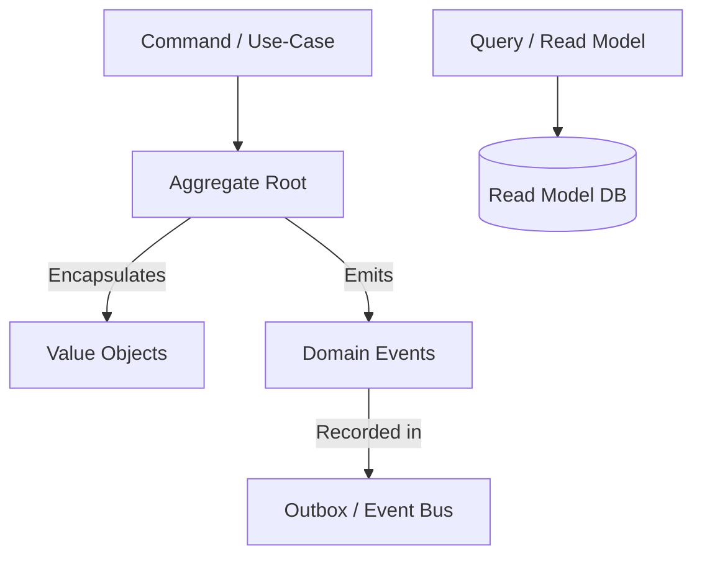

# RFC: Phase 10 - Tactical Domain-Driven Design (DDD) Code-Gen (v0.8.4)

- **Status**: IMPLEMENTED
- **Author**: Aetheris Core Team
- **Date**: 2026-08-06
- **Target Release**: `v0.8.4`
- **Branch**: `feature/v0.8.4-tactical-ddd`

---

## 1. Executive Summary

Phase 10 melengkapi generator taktikal Domain-Driven Design (DDD) murni di level `internal/core/domain` dan `internal/core/service`:
1. **Immutable Value Object (`make:valueobject [name]`)**: Objek tanpa identitas eksplisit dengan validasi internal dan immutability.
2. **Aggregate Root (`make:aggregate [name]`)**: Boundary transaksi DDD dengan state invariant checking dan uncommitted domain event recording.
3. **Domain Event (`make:event [name]`)**: Event struct dengan metadata perunut (OccurredAt, EventID, AggregateID) dan JSON serializer.
4. **CQRS Command & Handler (`make:command [name]`)**: Command DTO dan execution handler per-use case.
5. **CQRS Query & Handler (`make:query [name]`)**: Query DTO dan read-model handler per-use case.

---

## 2. Mermaid Diagram: Tactical DDD Interaction

