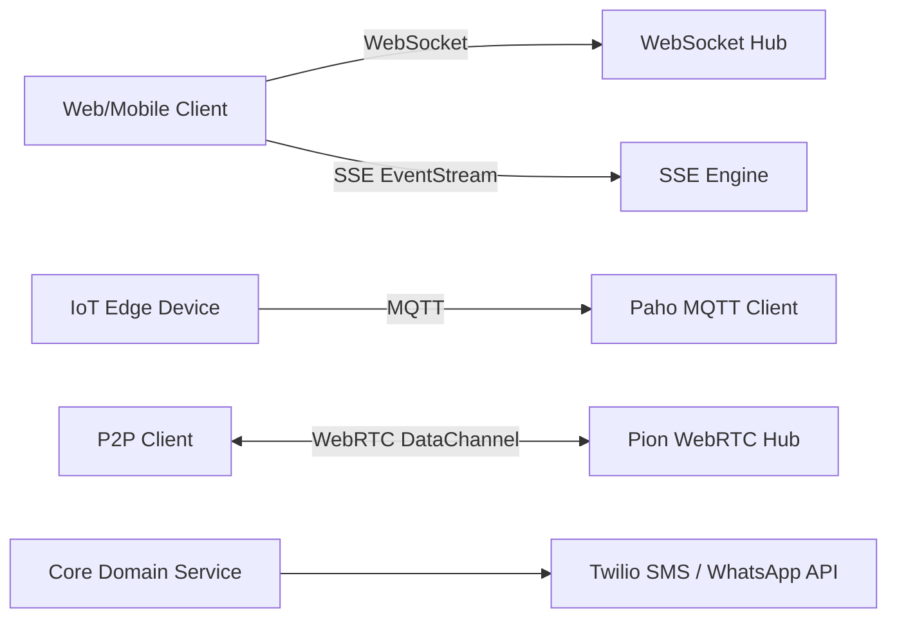

# RFC: Phase 11 - Realtime, WebSockets & Communication (`v0.8.5`)

- **Status**: IMPLEMENTED
- **Author**: Aetheris Core Team
- **Date**: 2026-08-06
- **Target Release**: `v0.8.5`
- **Branch**: `feature/v0.8.5-realtime-comms`

---

## 1. Executive Summary

Phase 11 melengkapi kapabilitas komunikasi dua arah, streaming real-time, IoT protocol, dan omni-channel messaging:
1. **WebSocket Hub (`add:websocket [gorilla|nhooyr]`)**: Multi-client WebSocket connection pool & broadcast hub dengan heartbeat ping/pong.
2. **Server-Sent Events (`add:sse`)**: HTTP unidirectional live streaming handler untuk real-time updates / AI token streaming.
3. **Pion WebRTC Hub (`add:webrtc [pion]`)**: Peer-to-peer data channel & media signaling session engine.
4. **MQTT Pub/Sub (`add:mqtt [paho]`)**: MQTT 3.1.1/5.0 IoT messaging client dengan TLS dan persistent session.
5. **Twilio SMS & WhatsApp Client (`add:twilio`)**: Transactional SMS and WhatsApp omni-channel delivery client.

---

## 2. Mermaid Diagram: Realtime Architecture

