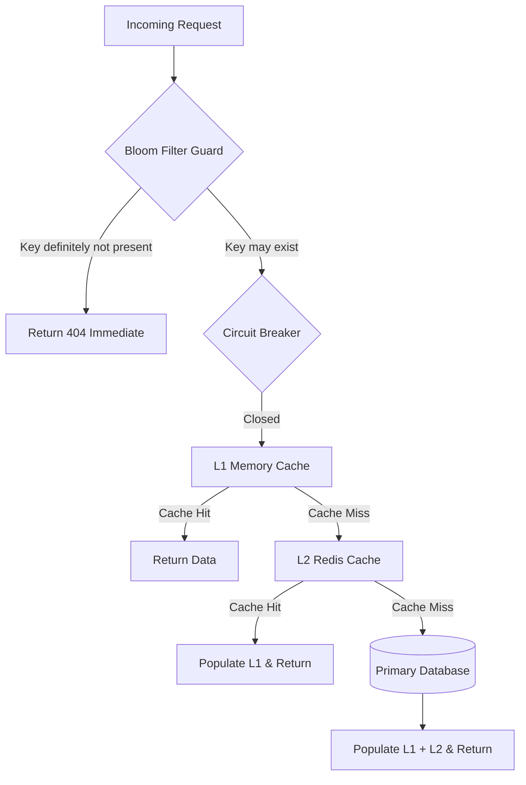

# RFC: Phase 12 - High-Performance Caching & Storage Engine (`v0.8.6`)

- **Status**: IMPLEMENTED
- **Author**: Aetheris Core Team
- **Date**: 2026-08-06
- **Target Release**: `v0.8.6`
- **Branch**: `feature/v0.8.6-caching-storage`

---

## 1. Executive Summary

Phase 12 menyediakan fondasi caching bertingkat, perlindungan penetrasi cache, S3 storage presigning, circuit breaker, dan full-text search:
1. **Multi-Level Cache (`add:multilevelcache`)**: Sinkronisasi L1 in-memory (Ristretto/Go-Cache) dengan L2 Redis terdistribusi melalui Pub/Sub invalidation.
2. **Bloom Filter Guard (`add:bloomfilter`)**: Filter probabilistik untuk mencegah cache penetration attack pada non-existent keys.
3. **S3 Multi-Part Storage Client (`add:s3 [minio|aws]`)**: S3 client dengan pre-signed upload/download URL generation.
4. **Resilience Engine (`add:resilience [hystrix|resilience4go]`)**: Circuit breaker, bulkhead concurrent call limiter, dan fallback handler.
5. **Search Engine (`add:search [meilisearch|elasticsearch]`)**: Fast typo-tolerant full-text search client dan index synchronization.

---

## 2. Mermaid Diagram: Multi-Level Caching & Resilience

