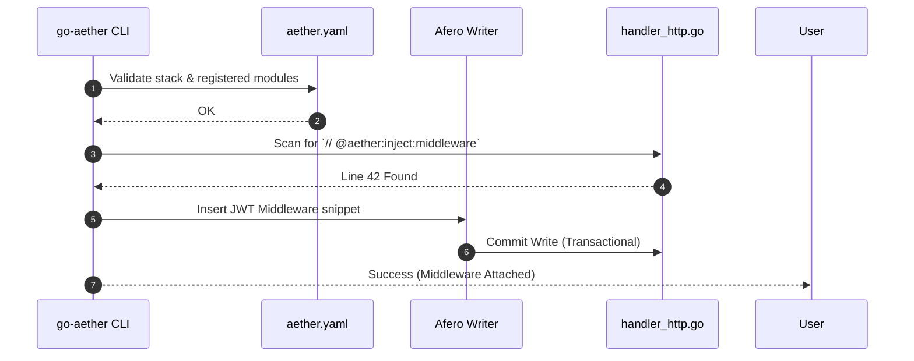

# RFC: Phase 2 Granular Ecosystem & Middleware Expansion

- **Status:** `PROPOSED`
- **RFC Tier (T-Shirt Size):** `Tier 1 (Full RFC)`
- **Tanggal:** 2026-08-06
- **Target Branch:** `feature/phase2-ecosystem`
- **RACI Governance Matrix (Top 1% VP Standard):**
  - **Responsible (Author):** AI Main Agent (AETHERIS)
  - **Accountable (Approver):** User / Principal Architect (Menunggu "Gasskan")
  - **Consulted (Security & QA):** Adversarial QA Subagent
  - **Informed (Stakeholders):** Seluruh pengguna v1.0.0

---

## 1. Konteks & Problem Statement
- **Latar Belakang & Urgensi:** v1.0.0 telah sukses meletakkan struktur absolut *Hexagonal Architecture*. Namun, API di dunia nyata membutuhkan injeksi operasional seperti JWT Authentication, Redis Caching, dan Rate Limiting. Developer saat ini terpaksa menambahkannya secara manual pasca-scaffold, yang berisiko merusak kerapian injeksi.
- **Scope Boundaries:**
  - **IN-SCOPE:** Generator komponen terpisah (`make:service`, `make:handler`), injektor middleware dasar (`add:middleware jwt-auth, rate-limit`), infrastruktur adapter sederhana (`add:transport grpc`, `add:cache redis`).
  - **EXPLICIT NON-GOALS:** Otomasi Kubernetes, Kafka worker, dan integrasi AI (ini ditahan murni untuk Fase 3 dan 4 agar scope tidak bengkak).
- **AWS Working Backwards (Adversarial PR/FAQ):**
  - *FAQ 1: Apa yang terjadi jika user mencoba meng-inject middleware pada transport yang belum ada?* -> Mesin wajib mengecek `aether.yaml` terlebih dahulu. Jika transport tidak cocok, CLI menolak dengan pesan error gracefully (Fail-Fast).
  - *FAQ 2: Apakah `add:middleware` akan menulis ulang seluruh file?* -> Tidak, CLI dirancang menggunakan AST Parsing sederhana atau string injection berbasis `// [aether:inject]` marker untuk mencegah kerusakan kode kustom developer.

---

## 2. Eksplorasi Arsitektur & Trade-off Matrix

### Opsi A: AST (Abstract Syntax Tree) Parsing Murni
- **Deskripsi Arsitektur:** Membaca kode Go user menggunakan `go/ast`, memodifikasi *tree* memori, lalu menyimpannya.
- **Kelebihan:** Sangat presisi, bebas dari salah *replace* string, tidak butuh tag penanda di dalam kode.
- **Kekurangan & Failure Modes:** Super kompleks. Modifikasi file `go` yang kotor (*syntax error*) akan menyebabkan CLI crash.
- **Reversibility:** `One-Way Door`

### Opsi B: Template Fragment Injection (Marker-based)
- **Deskripsi Arsitektur:** Saat `init`, file memuat *magic marker* tersembunyi seperti `// @aether:router:middlewares`. Perintah `add:middleware` cukup mencari marker ini via Regex/String Replace dan menginjeksinya.
- **Kelebihan:** Sangat ringan, mudah diprogram, dan berjalan 100% cepat di ekosistem `go-aether`.
- **Kekurangan & Failure Modes:** Jika user tidak sengaja menghapus komentar marker, CLI kehilangan arah.
- **Reversibility:** `Two-Way Door` (Sangat disarankan untuk kelincahan Fase 2).

### Opsi C: External Plugin System (Lua/WASM)
- **Deskripsi Arsitektur:** Middleware logic ditulis di Lua/WASM terpisah.
- **Kekurangan:** Terlalu *over-engineered* untuk CLI statis pembentuk perancah (Scaffolder).

---

## 3. Spesifikasi Teknis & Desain Sistem Terpilih
### 3.1 Topologi & Visualisasi Arsitektur (Marker Injection)

### 3.2 Penanganan Kasus Tepi (Edge Cases)
1. **Double Injection:** Jika user mengetik `add:middleware jwt` dua kali, CLI memindai baris eksisting. Jika sintaks sudah ada, lewati (*Idempotent*).
2. **Missing Marker:** Jika *magic marker* terhapus, cetak pesan peringatan elegan dengan instruksi manual.

---

## 4. Rencana Eksekusi & Living Task Checklist (DAG Batch Protocol)

### Batch 1: Granular Sub-Generators
* **DependsOn:** `[]`
- [ ] `[NEW]` Logika `go-aether make:service` & `make:handler` di dalam `make_service.go`
- [ ] Uji unit dan sinkronisasi ke Cobra CLI.

### Batch 2: Middleware Injection Engine
* **DependsOn:** `[Batch 1]`
- [ ] `[NEW]` AST / Marker Injection Engine di dalam core `internal/core/service/add_service.go`.
- [ ] Tambahkan perintah dasar Cobra `add:middleware` (JWT, Rate Limit).

### Batch 3: Transport & Cache (Infrastruktur Dasar)
* **DependsOn:** `[Batch 2]`
- [ ] `[NEW]` Template `repository_redis.go.tmpl`
- [ ] `[NEW]` Perintah `add:cache` dan `add:transport grpc`.

### Batch 4: Verifikasi & Rilis v0.2.0
* **DependsOn:** `[Batch 3]`
- [ ] Validasi E2E penggabungan *HTTP + JWT + Redis*.

---

## 5. Observabilitas & Verifikasi Mutu
- **Regresi Baseline:** Eksekusi `go test -race ./...` harus lulus 100% setelah integrasi injektor baru.
- **Kompilasi Cepat:** Binary tidak boleh membengkak >15MB.
