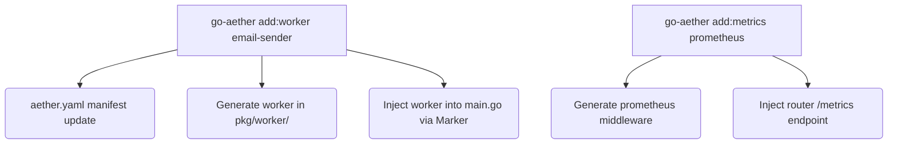

# PRD (Product Requirements Document)

## 1. Executive Summary
Phase 3 bertujuan mengeskalasi `go-aether` dari sekadar generator arsitektur monolit (Phase 1 & 2) menjadi fondasi *Distributed Systems* yang utuh. Fase ini akan menanamkan otomatisasi instalasi komponen asynchronous processing (`add:worker`), Message Broker interfaces (`add:eventing`), dan sistem Observabilitas (Prometheus metrics & OpenTelemetry tracing).

## 2. Latar Belakang & Visi 5W1H
* **Why**: Di lingkungan arsitektur microservices/event-driven, boiler-plate untuk mengonfigurasi worker (Kafka/Redis) dan telemetry (OTel/Prometheus) memakan waktu lama dan sering tidak konsisten.
* **Who**: Engineer skala menengah hingga senior yang bertugas mengonversi fitur monolitik menjadi asinkron atau memecah *bounded context*.
* **What**: Mengimplementasikan `add:worker`, `add:eventing`, `add:metrics prometheus`, dan `add:tracing`.
* **When**: Segera setelah Phase 2 tuntas dan dirilis.
* **Where**: Di engine `go-aether` (paket CLI & Generator) serta koleksi *templates* bawaan.
* **How**: Sama dengan Phase 2, pendekatan yang digunakan adalah templating standar ditambah injeksi deklaratif atau sekadar penyusunan infrastruktur global.

---

# Desain Teknis (Architecture & Engineering)

## 3. Komponen Sistem & Diagram
Arsitektur penambahan *Distributed Systems*:

## 4. Struktur Data & Kontrak Antarmuka (Interface)
1. **`internal/core/port/generator.go`**
   - Menambahkan metode baru: `AddWorker(...)`, `AddMetrics(...)`, `AddEventing(...)`.
2. **`templates/distributed/worker_asynq.go.tmpl`** & **`templates/distributed/worker_kafka.go.tmpl`**
   - Template dasar untuk asynq worker dan kafka.
3. **`templates/common/metrics_prometheus.go.tmpl`**
   - Prometheus /metrics route + middleware logger.

## 5. Security & STRIDE Threat Model
- **Spoofing**: N/A untuk generator.
- **Tampering**: Modifikasi file *handler* atau *main.go* menggunakan fungsi *Transactional Buffer* dengan *Idempotency Check* agar tidak menyisipkan injeksi ganda.
- **Repudiation**: CLI berjalan lokal.
- **Information Disclosure**: Endpoint `/metrics` secara opsional diamankan, namun pada tahap *scaffolding*, ini akan diekspos sebagai route standar.
- **Denial of Service (DoS)**: Prometheus middleware harus diletakkan sebelum logika berat agar metrics tidak terganggu oleh traffic.
- **Elevation of Privilege**: N/A.

---

# Rencana Eksekusi (Batch Protocol)

### Batch 1: Asynchronous Worker (Redis Asynq & Kafka)
- `[ ]` Buat template `worker_asynq.go.tmpl` dan `worker_kafka.go.tmpl`.
- `[ ]` Implementasi `AddWorker` di `add_service.go` dan CLI `add:worker`.

### Batch 2: Eventing Foundation
- `[ ]` Buat template `event_bus.go.tmpl` (Publisher & Subscriber Interface).
- `[ ]` Implementasi `AddEventing` dan CLI `add:eventing`.

### Batch 3: Observability (Prometheus & Tracing)
- `[ ]` Buat template `metrics_prometheus.go.tmpl` (Prometheus) dan `tracing_otel.go.tmpl`.
- `[ ]` Implementasi `AddMetrics` dan CLI `add:metrics prometheus`.
- `[ ]` Implementasi `AddTracing` dan CLI `add:tracing`.

### Batch 4: Verifikasi & Rilis v0.3.0
- `[ ]` Validasi di proyek `e-commerce-ultimate` untuk `add:worker` dan `add:metrics`.
- `[ ]` Jalankan E2E Go tests, commit, dan push tag `v0.3.0`.
