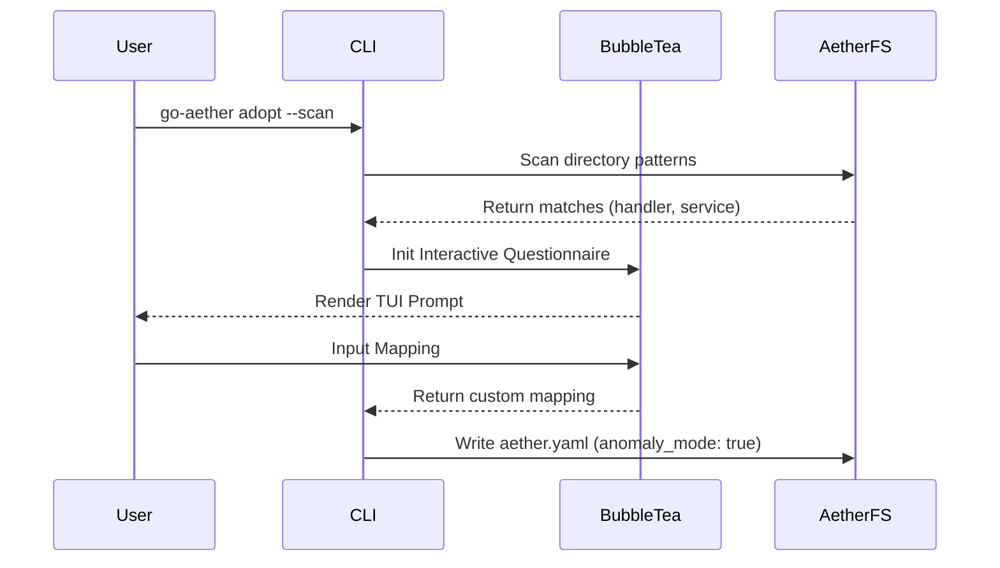

# PRD (Product Requirements Document)

## 1. Executive Summary
Phase 4 merupakan tonggak pencapaian terakhir dari **Grand Blueprint `go-aether`** (v0.4.0). Fase ini membawa CLI engine dari sistem lokal menuju *production-ready deployment* via Kubernetes, mengotomatisasi GitHub Actions CI/CD, mengintegrasikan kerangka kerja *Artificial Intelligence* (AI LLM Proxy), dan yang paling fenomenal: mode **Brownfield Adoption** (`adopt --scan`) dengan antarmuka TUI interaktif.

## 2. Latar Belakang & Visi 5W1H
* **Why**: Menjawab tantangan nyata di industri bahwa 90% proyek bukanlah *greenfield*, melainkan *brownfield* (kode warisan) yang butuh diadopsi perlahan. Selain itu, *deployment* selalu menjadi bottleneck terakhir.
* **Who**: Engineer yang harus meng-K8s-kan aplikasinya dan memigrasi sistem lama tanpa merombak ulang.
* **What**: `add:deploy k8s`, `add:cicd github`, `add:ai llm-proxy`, dan antarmuka interaktif `adopt --scan` dengan Bubble Tea.
* **When**: Tahap pamungkas *Grand Blueprint*.
* **Where**: Di engine `go-aether`.
* **How**: TUI akan dipandu dengan kuesioner interaktif, K8s yaml dan AI handler akan dihasilkan via `text/template`.

---

# Desain Teknis (Architecture & Engineering)

## 3. Komponen Sistem & Diagram
Arsitektur TUI untuk `adopt --scan`:

## 4. Struktur Data & Kontrak Antarmuka (Interface)
1. **`internal/core/port/generator.go`**
   - Tambahan: `AddDeploy(...)`, `AddCICD(...)`, `AddAI(...)`.
2. **`internal/core/service/adopt_service.go`**
   - Integrasi `charmbracelet/bubbletea` dan `huh` (atau TUI custom) untuk menangkap input.
3. **Templates Baru**
   - `templates/cloud/k8s_deployment.yaml.tmpl`
   - `templates/cloud/github_actions.yml.tmpl`
   - `templates/ai/llm_proxy.go.tmpl`

---

# Rencana Eksekusi (Batch Protocol)

### Batch 1: Cloud-Native & CI/CD
- `[ ]` Buat template `k8s_deployment.yaml.tmpl` dan `github_actions.yml.tmpl`.
- `[ ]` Implementasi antarmuka `AddDeploy` dan `AddCICD` beserta command Cobra.

### Batch 2: AI Integration (LLM-Proxy)
- `[ ]` Buat template `llm_proxy.go.tmpl` (interface proxy ke OpenAI/Anthropic).
- `[ ]` Implementasi antarmuka `AddAI` beserta command Cobra.

### Batch 3: Brownfield Adoption TUI (`adopt --scan`)
- `[ ]` Integrasi library TUI.
- `[ ]` Implementasi `adopt_service.go` yang bisa memindai direktori (mencari keberadaan folder handler, repository, service) lalu menampilkan menu interaktif ke *terminal*.
- `[ ]` Generate `aether.yaml` secara kustom dengan *anomaly mapping*.

### Batch 4: The Grand Finale Verifikasi & Rilis v0.4.0
- `[ ]` Jalankan adopsi *brownfield* di `e-commerce-ultimate` atau proyek dummy lainnya.
- `[ ]` Jalankan `go test ./...`
- `[ ]` Rilis `v0.4.0` (Grand Finale).
