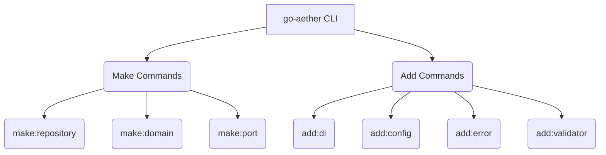

# PRD (Product Requirements Document)

## 1. Executive Summary
Fase 5 difokuskan pada pengayaan *Core Enterprise Patterns* di dalam `go-aether` (v0.5.0). Meskipun `make:module` sudah dapat meng-generate satu irisan vertikal secara penuh, seringkali *developer* membutuhkan generator independen (*standalone*) untuk Domain, Port, dan Repository. Fase ini juga mencakup standardisasi ekosistem internal seperti *Dependency Injection*, *Configuration Management*, penanganan *error* seragam, dan validasi *struct*.

## 2. Latar Belakang & Visi 5W1H
* **Why**: Menghindari *boilerplate* ketika *developer* hanya butuh membuat satu *layer* spesifik (misal, cuma nambah `repository` baru) tanpa harus membuat satu modul utuh.
* **Who**: Backend engineer yang membutuhkan presisi tingkat tinggi dalam struktur proyeknya.
* **What**: `make:repository`, `make:domain`, `make:port`, `add:di`, `add:config`, `add:error`, `add:validator`.
* **When**: Tahap lanjutan iterasi menuju v1.0.0.
* **Where**: Di dalam CLI Engine `go-aether`.
* **How**: Ekstensi dari `ScaffoldService` dengan template standar industri (misal integrasi `go-playground/validator`).

---

# Desain Teknis (Architecture & Engineering)

## 3. Komponen Sistem & Diagram

## 4. Struktur Data & Kontrak Antarmuka (Interface)
1. **`internal/core/port/generator.go`**
   - Tambahan: `MakeDomain`, `MakePort`, `MakeRepository`.
   - Tambahan: `AddDI`, `AddConfig`, `AddError`, `AddValidator`.
2. **Templates Baru**
   - `templates/hexagonal/domain_only.go.tmpl`
   - `templates/hexagonal/port_only.go.tmpl`
   - `templates/hexagonal/repository_only.go.tmpl`
   - `templates/common/di.go.tmpl`
   - `templates/common/config.go.tmpl`
   - `templates/common/error.go.tmpl`
   - `templates/common/validator.go.tmpl`

---

# Rencana Eksekusi (Batch Protocol)

### Batch 1: Standalone Generators (`make:*`)
- `[ ]` Buat template `domain_only`, `port_only`, `repository_only`.
- `[ ]` Implementasi `MakeDomain`, `MakePort`, `MakeRepository` di Service.
- `[ ]` Registrasi command `make:domain`, `make:port`, `make:repository`.

### Batch 2: Advanced Injection (`add:di`, `add:config`)
- `[ ]` Buat template injektor dependensi dan *config* terpusat.
- `[ ]` Implementasi `AddDI` dan `AddConfig`.
- `[ ]` Registrasi CLI command.

### Batch 3: Standardization (`add:error`, `add:validator`)
- `[ ]` Buat template untuk standar penanganan HTTP error dan Go-Playground validator.
- `[ ]` Implementasi `AddError` dan `AddValidator`.
- `[ ]` Registrasi CLI command.

### Batch 4: Verifikasi & Rilis v0.5.0
- `[ ]` Jalankan CLI baru pada `e-commerce-ultimate`.
- `[ ]` Lakukan `go test ./...`
- `[ ]` Commit, tag `v0.5.0`, dan Push.
