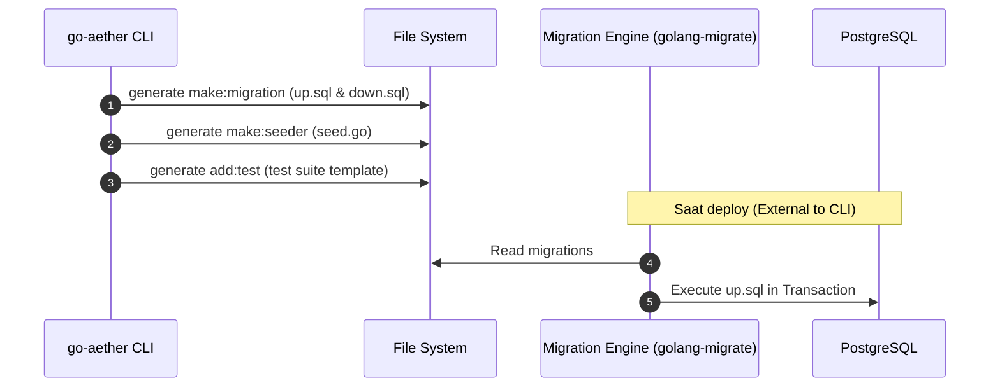

# RFC: Phase 6 Data, Migration & QA

- **Status:** `PROPOSED`
- **RFC Tier (T-Shirt Size):** `Tier 1 (Full RFC)`
- **Tanggal:** 2026-08-06
- **Target Branch:** `feature/phase6-data-qa`
- **RACI Governance Matrix (Top 1% VP Standard):**
  - **Responsible (Author):** AI Main Agent
  - **Accountable (Approver):** User
  - **Consulted (Security & QA):** Go Mastery
  - **Informed (Stakeholders):** Backend Team

---

## 1. Konteks & Problem Statement (PRD & AWS Working Backwards Core)
- **Latar Belakang & Urgensi:** Membangun arsitektur yang hebat belum cukup tanpa sistem migrasi skema database yang terstruktur dan pengujian otomatis. Pada Phase 6, `go-aether` akan dilengkapi dengan kapabilitas scaffolding untuk Data Migration, Seeder, dan Test Automation.
- **Scope Boundaries:**
  - **IN-SCOPE:** Generator `make:migration`, `make:seeder`, `add:test` (mocking & unit test scaffold), dan fondasi kapabilitas multitenancy (RLS/Column-based).
  - **EXPLICIT NON-GOALS:** ORM implementation (tetap menggunakan raw SQL/sqlc/QueryBuilder), eksekusi migrasi dari dalam CLI (CLI hanya men-generate file migrasi, eksekusi menggunakan golang-migrate/goose).
- **Asumsi Epistemik & Skala:**
  - **Target Throughput / Load:** Skema database dirancang untuk puluhan hingga ratusan tabel, sanggup menskalakan puluhan tenant (untuk modul multitenancy).
  - **Asumsi Sistem & Tenant:** Multitenancy akan mendukung dua pola: Table/Column-based tenant isolation atau Schema-based isolation.
- **AWS Working Backwards:**
  - **Buy vs. Build vs. Partner:** Menggunakan standar open-source (misalnya golang-migrate format up/down) alih-alih membuat format migrasi sendiri.
  - **FAQ 1: Apa yang terjadi jika migrasi gagal di tengah jalan?** -> Generator selalu membuat versi skema Up dan Down untuk transaksi ACID atau rollback manual.

---

## 2. Eksplorasi Arsitektur & Trade-off Matrix

### Opsi A: Flat Migration Files & Mockery
- **Deskripsi Arsitektur:** Migrasi berformat SQL raw flat (up/down). Test menggunakan library standard `testing` + `testify` + `mockery`.
- **Kelebihan (≥3):** 1. Paling standar di Go. 2. Sangat cepat. 3. Tooling universal (golang-migrate).
- **Kekurangan & Failure Modes (≥3):** 1. Penamaan file migrasi bisa bentrok jika dikembangkan secara paralel. 2. SQL dialect specific. 3. Mockery membutuhkan antarmuka eksplisit.
- **Reversibility:** `Two-Way Door`

### Opsi B: Go-based Migrations (GORM/Ent) & Testcontainers
- **Deskripsi Arsitektur:** Migrasi didefinisikan dengan struct Go. Test menggunakan Testcontainers untuk memutar database asli dockerized.
- **Kelebihan (≥3):** 1. Tipe-aman (Type-safe). 2. Tidak dialect specific. 3. Test integrasi murni.
- **Kekurangan & Failure Modes (≥3):** 1. Lambat untuk CI (overhead Testcontainers). 2. Memaksa adopsi ORM yang berat. 3. Tidak sejalan dengan prinsip arsitektur murni Hexagonal `go-aether` yang condong ke Raw SQL/sqlc.
- **Reversibility:** `One-Way Door`

**Keputusan:** Opsi A. Menggunakan standard raw SQL format dengan `golang-migrate` convention, karena sejalan dengan filosofi `go-aether` (ringan, independen, murni).

---

## 3. Spesifikasi Teknis & Desain Sistem Terpilih
### 3.1 Topologi & Visualisasi Arsitektur

### 3.2 Data Model & Migration Strategy
- **Format Nama File:** `YYYYMMDDHHMMSS_<name>.up.sql` dan `.down.sql`.
- **Multitenancy:** Injeksi kolom `tenant_id` atau Row Level Security (RLS) script di postgres.

### 3.3 Kontrak CLI & Commands
- `go-aether make:migration [name]` -> `migrations/2026..._name.up.sql`
- `go-aether make:seeder [name]` -> `cmd/seeder/name.go`
- `go-aether add:test` -> `tests/setup.go` & `Makefile` command for tests.

### 3.4 Penanganan Konkurensi & Failure
- Migrasi dieksekusi secara idempotent dengan mencatat versi di tabel `schema_migrations`.
- Test suite akan mengisolasi koneksi (Database Transaction per Test) agar tidak bocor.

### 3.5 STRIDE Threat Model
| Vektor Ancaman STRIDE | Skenario Serangan | Mitigasi Arsitektural |
| :--- | :--- | :--- |
| **Information Disclosure** | Data test/seed terekspos ke production | Strict environment checks (`if env == "production" { panic("cannot run seeders") }`) |

---

## 4. Rencana Eksekusi & Living Task Checklist

### Batch 1: Database Migration & Seeder Scaffold
* **DependsOn:** `[]`
* **Goal:** Menghasilkan CLI command untuk migrasi database & injeksi seeder.
- [ ] Buat template SQL migration (`up` & `down`).
- [ ] Implementasi `MakeMigration` di `make_service`.
- [ ] Buat template seeder Go.
- [ ] Implementasi `MakeSeeder` di `make_service`.

### Batch 2: Test Harness & Multitenancy Scaffold
* **DependsOn:** `[Batch 1]`
* **Goal:** Menginjeksi infrastruktur test (Testify, Mock setup) dan pola RLS multitenancy.
- [ ] Implementasi `AddTest` (setup test helper).
- [ ] Implementasi `AddMultitenancy` (injeksi kolom/RLS sql).

### Batch 3: CLI Registration & E2E Validation
* **DependsOn:** `[Batch 2]`
* **Goal:** Hubungkan ke command Cobra dan validasi E2E.
- [ ] Registrasi commands di root.
- [ ] Verifikasi Build & Test suite.
- [ ] Rilis `v0.6.0`.

---

## 5. Observabilitas & Verifikasi Mutu
- Rencana Pengujian: `go test -race ./...` setelah implementasi.
- Self-Review Checklist:
  - OWASP Top 10: `nihil` (hanya code generator).
  - Race condition: `nihil`.

---

## 6. Prosedur Rollback & Runbook
- Karena ini adalah alat CLI (Code Generator), jika fitur ini menghasilkan kode yang salah (bug), perbaikan akan didistribusikan pada versi *patch* CLI. Backward compatibility terjamin karena tidak mengubah file pengguna tanpa tanda `-f` (force).
