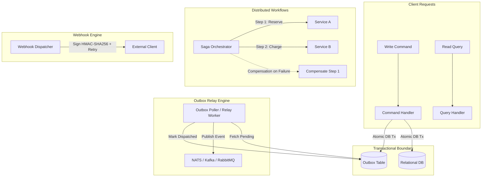

# RFC: Phase 7 - Advanced Distributed Patterns (v0.7.0)

- **Status**: IMPLEMENTED
- **Author**: Aetheris Core Team
- **Date**: 2026-08-06
- **Target Release**: `v0.7.0`
- **Branch**: `feature/phase7-distributed-patterns`

---

## 1. Executive Summary & Problem Statement

Sistem monolit modular modern atau microservices skala enterprise sering kali menghadapi tantangan konsistensi data lintas batas (*distributed data consistency*), pemisahan operasi baca/tulis yang ekstrem, keandalan pengiriman event (*dual-write problem*), pertukaran webhook pihak ketiga yang aman, dan penemuan layanan dinamis (*service discovery*).

Phase 7 dari `go-aether` menghadirkan generator pola terdistribusi tingkat lanjut (*Advanced Distributed Patterns*) murni tanpa ketergantungan framework runtime berat:
1. **CQRS (`add:cqrs`)**: Pemisahan Command & Query handlers untuk optimasi read/write scaling.
2. **Transactional Outbox (`add:outbox`)**: Menjamin atomisitas penyimpanan database lokal bersama publikasi event ke broker pesan (mencegah *dual-write anomaly*).
3. **Distributed Saga (`add:saga`)**: Pola orkestrasi transaksi terdistribusi berbasis kompensasi (*compensation rollback*).
4. **Secure Webhook Dispatcher & Receiver (`add:webhook`)**: Pengiriman webhook ber-tanda tangan HMAC-SHA256, exponential retry backoff, dan middleware verifikasi signature.
5. **Service Discovery Integration (`add:discovery`)**: Registrasi dan resolusi endpoint layanan dinamis via HashiCorp Consul atau CoreOS etcd.

---

## 2. Visual Architecture & Flow Diagram

---

## 3. Detailed Specification & Command Interfaces

### 3.1 `add:cqrs [module-name]`
- Membangkitkan `internal/modules/<module>/cqrs/`:
  - `command.go`: Struct command dan CommandHandler interface.
  - `query.go`: Struct query dan QueryHandler interface.
  - `bus.go`: Simple in-memory command/query dispatcher.

### 3.2 `add:outbox`
- Membangkitkan tabel migrasi SQL outbox (`migrations/<timestamp>_create_outbox.up.sql`).
- Membangkitkan `pkg/outbox/outbox.go`:
  - `OutboxRepository` untuk insert event dalam transaksi aktif (`tx`).
  - `OutboxRelay` worker background dengan batched polling, exponential backoff, dan publisher adapter.

### 3.3 `add:saga [workflow-name]`
- Membangkitkan `pkg/saga/saga.go` (generic saga step engine dengan context cancellation).
- Membangkitkan contoh implementasi workflow `internal/workflows/<workflow>_saga.go` dengan fungsi `Execute` dan `Compensate`.

### 3.4 `add:webhook`
- Membangkitkan `pkg/webhook/dispatcher.go` (HTTP webhook dispatcher dengan HMAC-SHA256 signature generator dan backoff retry).
- Membangkitkan `pkg/webhook/receiver.go` (HTTP middleware untuk verifikasi header `X-Signature-SHA256` dan timestamp replay protection).

### 3.5 `add:discovery [provider]`
- Mendukung `--provider=consul` atau `--provider=etcd`.
- Membangkitkan `pkg/discovery/<provider>.go` untuk registrasi health check TTL dan dynamic service resolver.

---

## 4. Batch Tasks Breakdown

- [ ] **Batch 1: CQRS & Transactional Outbox Pattern**
  - [ ] Buat template `cqrs_module.go.tmpl`
  - [ ] Buat template `outbox.go.tmpl` & SQL migrasi outbox
  - [ ] Implementasi `AddCQRS` & `AddOutbox` di `internal/core/service/add_service.go`
- [ ] **Batch 2: Distributed Saga & Secure Webhook Infrastructure**
  - [ ] Buat template `saga_orchestrator.go.tmpl` & `saga_workflow.go.tmpl`
  - [ ] Buat template `webhook_dispatcher.go.tmpl` & `webhook_receiver.go.tmpl`
  - [ ] Implementasi `AddSaga` & `AddWebhook` di `internal/core/service/add_service.go`
- [ ] **Batch 3: Service Discovery & CLI Registration**
  - [ ] Buat template `discovery_consul.go.tmpl` & `discovery_etcd.go.tmpl`
  - [ ] Implementasi `AddDiscovery` di `internal/core/service/add_service.go`
  - [ ] Daftarkan seluruh perintah di `internal/adapter/cli/add.go` & `root.go`
  - [ ] Verifikasi E2E, Merge ke `main`, dan Release `v0.7.0`
