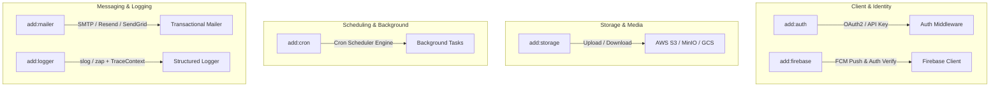

# RFC: Phase 8 - Cloud, Auth & 3rd-Party Plugins (v0.8.0)

- **Status**: IMPLEMENTED
- **Author**: Aetheris Core Team
- **Date**: 2026-08-06
- **Target Release**: `v0.8.0`
- **Branch**: `feature/phase8-cloud-plugins`

---

## 1. Executive Summary & Problem Statement

Untuk mencapai kesiapan operasional skala enterprise yang paripurna, aplikasi backend memerlukan integrasi pihak ketiga (*third-party adapters*) yang modular, dapat diuji (*testable*), dan bebas *vendor lock-in*.

Phase 8 menyempurnakan ekosistem `go-aether` dengan rangkaian plugin dan generator siap pakai:
1. **OAuth2 & API Key Auth (`add:auth`)**: Autentikasi modern berbasis penyedia OAuth2 (Google/GitHub) dan verifikasi API Key berbasis header.
2. **Cloud Blob Storage (`add:storage`)**: Abstraksi antarmuka `Uploader` / `Downloader` dengan adapter AWS S3 / MinIO dan Google Cloud Storage (GCS).
3. **Cron Job Scheduler (`add:cron`)**: Penjadwalan tugas berkala (*background recurring job*) dengan graceful shutdown dan recovery.
4. **Email / Mailer Service (`add:mailer`)**: Pengiriman email transaksional berbasis SMTP, Resend, atau SendGrid dengan template HTML.
5. **Firebase Suite (`add:firebase`)**: Integrasi Firebase Auth token decoding dan Push Notification via Firebase Cloud Messaging (FCM).
6. **Structured Logger (`add:logger`)**: Injeksi modern structured logging (`log/slog` atau `uber-go/zap`) ber-konteks correlation ID dan trace ID.

---

## 2. Visual Architecture & Flow Diagram

---

## 3. Detailed Specification & Command Interfaces

### 3.1 `add:auth [oauth2|apikey]`
- Membangkitkan `pkg/auth/oauth2.go` atau `pkg/auth/apikey.go` dengan token exchange dan middleware verifikasi.

### 3.2 `add:storage [s3|gcs|local]`
- Membangkitkan `pkg/storage/storage.go` (antarmuka `Storage`) dan `pkg/storage/s3.go` (implementasi AWS SDK/MinIO).

### 3.3 `add:cron [job-name]`
- Membangkitkan `pkg/cron/scheduler.go` (in-process scheduler) dan `internal/jobs/<job>_job.go` (job runner logic).

### 3.4 `add:mailer [smtp|resend]`
- Membangkitkan `pkg/mailer/mailer.go` (antarmuka dan adapter SMTP / Resend).

### 3.5 `add:firebase`
- Membangkitkan `pkg/firebase/firebase.go` (FCM push notification dispatcher & token verifier).

### 3.6 `add:logger [slog|zap]`
- Membangkitkan `pkg/logger/logger.go` (structured logger initializer dengan context correlation extractor).

---

## 4. Batch Tasks Breakdown

- [ ] **Batch 1: Auth, Storage & Cron Subsystems**
  - [ ] Buat template `auth_oauth2.go.tmpl`, `auth_apikey.go.tmpl`
  - [ ] Buat template `storage_s3.go.tmpl`, `storage_interface.go.tmpl`
  - [ ] Buat template `cron_scheduler.go.tmpl`, `cron_job.go.tmpl`
  - [ ] Tambah interface & implementasi `AddAuth`, `AddStorage`, `AddCron`
- [ ] **Batch 2: Mailer, Firebase & Logger Subsystems**
  - [ ] Buat template `mailer_smtp.go.tmpl`, `firebase_client.go.tmpl`, `logger_slog.go.tmpl`
  - [ ] Tambah interface & implementasi `AddMailer`, `AddFirebase`, `AddLogger`
- [ ] **Batch 3: CLI Registration, README Refresh & Release v0.8.0**
  - [ ] Daftarkan seluruh subcommands baru di `internal/adapter/cli/add.go` & `root.go`
  - [ ] Perbarui `README.md` repositori utama secara menyeluruh
  - [ ] Uji kompilasi, verifikasi E2E di `e-commerce-ultimate`, commit dengan Co-author, merge ke `main`, tag `v0.8.0`, dan push!
