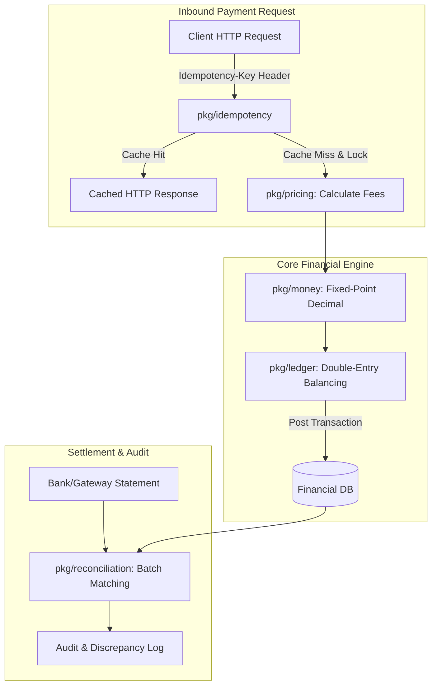

# RFC: Phase 9 - Fintech & Financial Reliability Engine (v0.8.3)

- **Status**: IMPLEMENTED
- **Author**: Aetheris Core Team
- **Date**: 2026-08-06
- **Target Release**: `v0.8.3`
- **Branch**: `feature/v0.8.3-fintech-engine`

---

## 1. Executive Summary

Untuk memenuhi standar kepatuhan PCI-DSS dan keandalan sistem perbankan/fintech, `go-aether` Phase 9 memperkenalkan 5 modul kritis:
1. **Idempotency Key Engine (`add:idempotency`)**: Atomic locking dan response caching untuk mencegah *duplicate charge* dan *replay attacks*.
2. **Double-Entry Ledger Engine (`add:ledger`)**: Struktur data akuntansi berprinsip debit/credit balance invariance (total debit == total credit).
3. **High-Precision Money Arithmetic (`add:decimal`)**: Helper aritmatika moneter berbasis fixed-point (`shopspring/decimal`).
4. **Automated Transaction Reconciliation (`add:reconciliation`)**: Parser laporan mutasi bank/settlement gateway dan matching engine.
5. **Rule-Based Pricing Engine (`add:pricing-engine`)**: Kalkulator diskon, tiering volume, dan fee per transaksi.

---

## 2. Visual Architecture & Flow Diagram

---

## 3. Specification

### 3.1 `add:idempotency [redis|memory]`
Membangkitkan `pkg/idempotency/idempotency.go` (HTTP middleware with distributed lock & response cache).

### 3.2 `add:ledger`
Membangkitkan `pkg/ledger/ledger.go` (Account, Entry, Transaction types with Zero-Sum Invariant validation).

### 3.3 `add:decimal`
Membangkitkan `pkg/money/money.go` (Money & Currency structs, rounding, formatting, conversion).

### 3.4 `add:reconciliation`
Membangkitkan `pkg/reconciliation/reconciliation.go` (Record matcher, status evaluator, mismatch reporting).

### 3.5 `add:pricing-engine`
Membangkitkan `pkg/pricing/pricing.go` (Tiered rules, percentage/fixed fee calculator).
