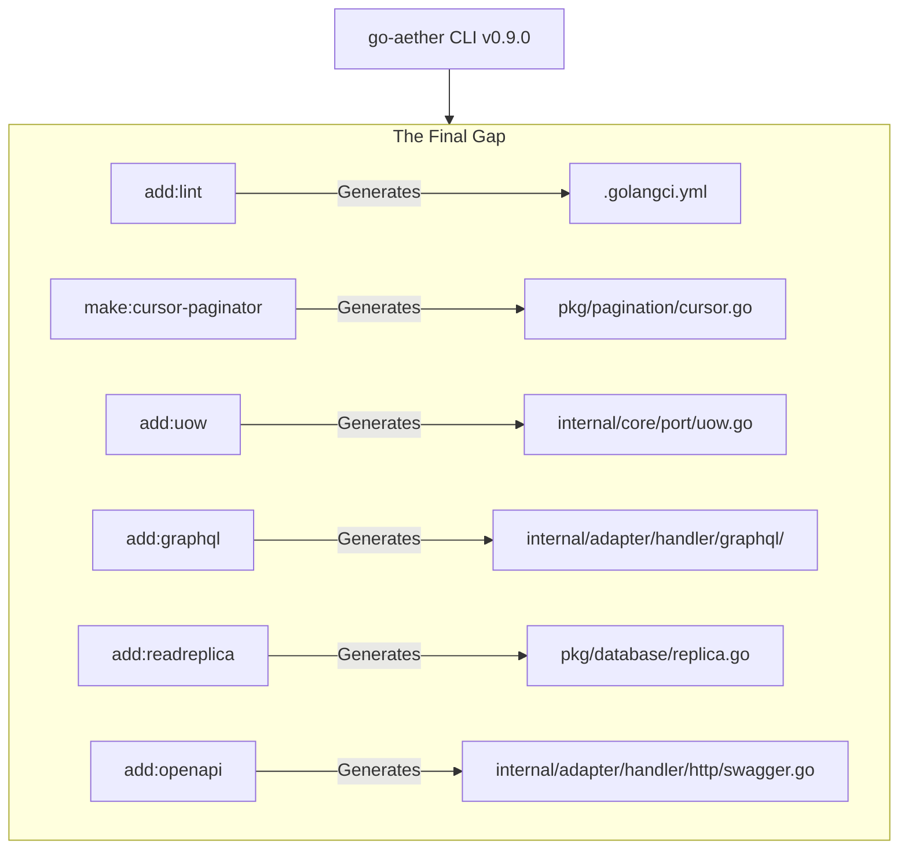

# RFC: Phase 16 — The Final Gap to v1.0.0 (v0.9.0)

- **Status:** `IMPLEMENTED`
- **RFC Tier (T-Shirt Size):** `Tier 1 (Full RFC)`
- **Tanggal:** 2026-08-07
- **Target Branch:** `feature/v0.9.0-final-gap`
- **RACI Governance Matrix (Top 1% VP Standard):**
  - **Responsible (Author):** AI Main Agent / Lead Engineer
  - **Accountable (Approver):** User / Principal Architect (Menunggu kata "Gasskan")
  - **Consulted (Security & QA):** Adversarial QA Subagent / Domain Mastery Reference
  - **Informed (Stakeholders):** Tim Operasional, Tim Frontend, Tim Support

---

## 1. Konteks & Problem Statement (PRD & AWS Working Backwards Core)
- **Latar Belakang & Urgensi:** Berdasarkan audit menyeluruh terhadap Grand Blueprint v1.0.0, CLI engine `go-aether` saat ini telah mengimplementasikan 84 dari 90 command. Tersisa 6 command penutup (mayoritas dari sisa Phase 14) untuk mencapai 100% Grand Parity. Mengimplementasikan 6 command ini akan merilis versi `v0.9.0` sebagai kandidat final sebelum rilis GA `v1.0.0`.
- **Scope Boundaries:**
  - **IN-SCOPE:** 
    1. `add:lint`: Linter (golangci-lint) & git pre-commit hook.
    2. `make:cursor-paginator`: Cursor-based opaque base64 pagination helper.
    3. `add:uow`: Unit of Work orchestrator pattern untuk multi-repo transactions.
    4. `add:graphql`: gqlgen GraphQL server dengan dataloader boilerplate.
    5. `add:readreplica`: DB connection pool spliter (Primary-Write, Replica-Read).
    6. `add:openapi`: Swagger/OpenAPI docs generator middleware.
  - **EXPLICIT NON-GOALS:** Melakukan refactor pada 84 command eksisting.
- **Asumsi Epistemik & Skala:**
  - **Target Throughput:** Boilerplate `go-aether` dirancang untuk O(1) scaffolding, tidak mempengaruhi runtime overhead kecuali fitur yang di-inject. GraphQL dan Unit of Work harus tetap highly performant tanpa reflection penalty berlebih.

---

## 2. Eksplorasi Arsitektur & Trade-off Matrix

### Opsi A: Inject Langsung ke `add_phase14.go`
- **Deskripsi:** Memasukkan command yang tertinggal ke file scaffolding Phase 14 yang lama.
- **Kelebihan (≥3):** 1. Menjaga struktur per fase historis, 2. Tidak menambah jumlah file CLI, 3. Mudah ditelusuri riwayatnya.
- **Kekurangan & Failure Modes (≥3):** 1. File Phase 14 mungkin sudah membengkak, 2. Kurang representatif secara versi (kini di v0.9.0 bukan v0.8.8), 3. Melanggar prinsip append-only architecture pada rilis.
- **Reversibility:** `Two-Way Door`

### Opsi B: Buat Modul Terpisah `add_v0.9.0.go` & `make_v0.9.0.go` (Terpilih)
- **Deskripsi:** Membuat file registrasi subcommand baru khusus untuk rilis v0.9.0.
- **Kelebihan (≥3):** 1. Isolasi code changes rapi di satu PR, 2. Tidak menyentuh file adapter lama (Open/Closed Principle), 3. Sinkron dengan label rilis v0.9.0.
- **Kekurangan & Failure Modes (≥3):** 1. Bertambahnya jumlah file CLI, 2. `make` dan `add` logic terpencar ke banyak file, 3. Perlu update manual di `root.go` yang semakin panjang.
- **Reversibility:** `Two-Way Door`

---

## 3. Spesifikasi Teknis & Desain Sistem Terpilih
### 3.1 Topologi & Visualisasi Arsitektur (Mermaid Blueprint)

### 3.2 Data Model & Struktur Template
6 Template baru akan ditambahkan di `templates/plugins/`:
- `lint.yml.tmpl` (Linter rules)
- `cursor_paginator.go.tmpl`
- `uow.go.tmpl`
- `graphql.go.tmpl`
- `readreplica.go.tmpl`
- `openapi.go.tmpl`

### 3.4 Kontrak API & Event Interface
- Penambahan fungsi scaffold pada interface `ScaffoldService`:
  - `AddLint(...)`
  - `MakeCursorPaginator(...)`
  - `AddUOW(...)`
  - `AddGraphQL(...)`
  - `AddReadReplica(...)`
  - `AddOpenAPI(...)`

### 3.6 STRIDE Threat Model & Security Perimeter
| Vektor Ancaman STRIDE | Potensi Celah / Skenario Serangan | Mitigasi Arsitektural & Guardrails |
| :--- | :--- | :--- |
| **Denial of Service** | N+1 Query pada GraphQL | Wajib embed DataLoader schema di template gqlgen. |
| **Information Disclosure** | OpenAPI Swagger leak data internal | OpenAPI di-set default pada router development / hidden route. |

---

## 4. Rencana Eksekusi & Living Task Checklist (DAG & Batch Protocol)

### Batch 1: Schema Locking & Templates Initialization
* **DependsOn:** `[]`
* **Goal:** Kunci kontrak interface `generator.go` dan buat ke-6 template scaffolding.
- [ ] `[NEW]` `templates/plugins/lint.yml.tmpl` dkk (6 files)
- [ ] `[MODIFY]` `internal/core/port/generator.go`

### Batch 2: Application Logic (Service Layer)
* **DependsOn:** `[Batch 1]`
* **Goal:** Implementasikan 6 method scafolding baru di `add_service.go` dan `make_service.go`.
- [ ] `[MODIFY]` `internal/core/service/add_service.go`
- [ ] `[MODIFY]` `internal/core/service/make_service.go`
- [ ] `[MODIFY]` `internal/core/service/service_test.go` (tambah test harness Phase 16 / v0.9.0)

### Batch 3: CLI Transport & Wiring
* **DependsOn:** `[Batch 2]`
* **Goal:** Daftarkan 6 command ke Cobra command tree.
- [ ] `[NEW]` `internal/adapter/cli/add_v0.9.0.go` & `make_v0.9.0.go`
- [ ] `[MODIFY]` `internal/adapter/cli/root.go`
- [ ] Verifikasi E2E & Validasi

---

## 5. Observabilitas & Verifikasi Mutu
- Rencana pengujian menggunakan test harness `go test -v ./...` dan test E2E fisik menggunakan binary terbaru di temporary project.
