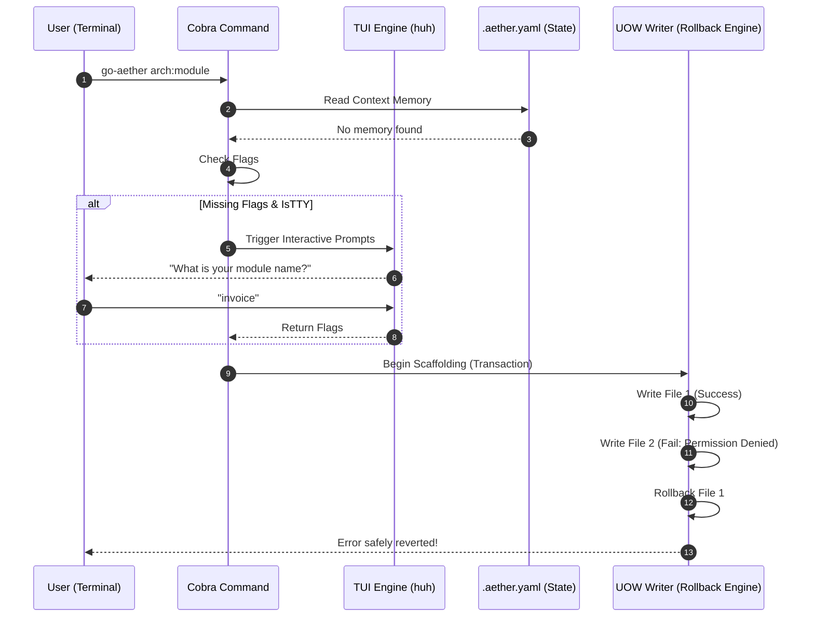

# RFC: Advanced UX & DX Deep Dive Overhaul (Interactive TUI, Context Memory, UOW)

- **Status:** `PROPOSED`
- **RFC Tier (T-Shirt Size):** `Tier 1 (Full RFC)`
- **Tanggal:** 2026-08-07
- **Target Branch:** `feature/ux-dx-deep-dive`
- **RACI Governance Matrix (Top 1% VP Standard):**
  - **Responsible (Author):** AI Main Agent / Lead Engineer
  - **Accountable (Approver):** User / Principal Architect (Menunggu kata "Gasskan")
  - **Consulted (Security & QA):** Adversarial QA Subagent / Domain Mastery Reference
  - **Informed (Stakeholders):** Tim Operasional, Tim Frontend, Tim Support

---

## 1. Konteks & Problem Statement (PRD & AWS Working Backwards Core)
- **Latar Belakang & Urgensi:** `go-aether` v0.1.0 memiliki taksonomi CLI tingkat dewa, namun pengalamannya masih *stateless* dan kaku. Kesalahan *typing* pada flag menyebabkan *hard crash*, tidak ada memori proyek lokal, dan kegagalan disk saat scaffolding bisa merusak repositori (*half-baked state*). Peningkatan DX (Developer Experience) ini adalah satu-satunya jembatan antara "alat yang bagus" menjadi "alat berstandar industri (Top 1%)".
- **Scope Boundaries:**
  - **IN-SCOPE:** Implementasi Interactive TUI (`charmbracelet/huh`), Context-Aware Memory (`.aether.yaml`), Unit of Work (Atomic Rollback) di `writer`, Rich Dry-Run Diffs (`pterm`), Auto-completion script, dan `go-aether doctor` yang mendalam.
  - **EXPLICIT NON-GOALS:** Penambahan fitur template scaffolding baru, migrasi ke framework CLI selain Cobra.
- **Asumsi Epistemik & Skala (Hasil Gerbang Klarifikasi §2):**
  - **Target Throughput / Load:** CLI Tool lokal, latensi TUI < 50ms, *startup time* < 100ms.
  - **Asumsi Sistem & Tenant:** Tooling berjalan di mesin developer (Windows/Mac/Linux).
- **AWS Working Backwards (Adversarial PR/FAQ & Buy vs. Build Justification):**
  - **Buy vs. Build vs. Partner:** TUI components akan mengadopsi `charmbracelet` (ecosystem teruji di Go), sedankan Atomic Rollback akan kita bangun secara *in-house* karena terikat dengan desain `port.FileWriter` Hexagonal kita.
  - **FAQ 1: Apa yang terjadi jika developer menjalankan ini di CI/CD tanpa dukungan TTY interaktif?** -> CLI harus secara otomatis mendeteksi ketiadaan TTY (atau mendeteksi flag `--non-interactive` / environment `CI=true`) dan *fallback* ke sistem flag standar atau melemparkan error jika flag wajib tidak terisi, guna mencegah proses CI *hanging*.
  - **FAQ 2: Apa yang terjadi jika Atomic Rollback gagal menghapus file korup?** -> CLI akan mencatatkan peringatan persisten merah dan menyuruh user menjalankan `git reset --hard` atau `go-aether clean`.

---

## 2. Eksplorasi Arsitektur & Trade-off Matrix (Anti-Yes-Man §4)

### Opsi A: Full TUI Replacement (Lipgloss/Bubbletea)
- **Deskripsi Arsitektur:** Membuang Cobra sepenuhnya dan merancang ulang aplikasi sebagai program Terminal UI (TUI) *full-screen* dari awal menggunakan Bubbletea.
- **Kelebihan (≥3):** 1. Visual sangat memukau (100% immersive). 2. Tidak butuh flag sama sekali. 3. Interaktivitas seperti aplikasi desktop.
- **Kekurangan & Failure Modes (≥3):** 1. Menghancurkan kompatibilitas script bash CI/CD lama. 2. *Overkill* untuk alat scaffolding cepat. 3. Mengharuskan penulisan ulang seluruh `internal/adapter/cli`.
- **Reversibility:** `One-Way Door` (Sangat merusak struktur eksisting).

### Opsi B: Hybrid Cobra + Fallback Prompting (TUI Library)
- **Deskripsi Arsitektur:** Mempertahankan arsitektur Cobra yang kuat. Ketika `RunE` dieksekusi, jika flag wajib tidak terisi, CLI tidak *crash*, melainkan memanggil TUI Prompting (`charmbracelet/huh`) untuk meminta masukan.
- **Kelebihan (≥3):** 1. 100% *backward compatible* (script CI/CD tetap aman jika memakai flag). 2. Sangat mulus bagi developer pemula. 3. Melindungi investasi arsitektur Hexagonal kita.
- **Kekurangan & Failure Modes (≥3):** 1. Membutuhkan tambahan pengecekan TTY di setiap perintah. 2. Penambahan dependensi eksternal ukuran besar (`charmbracelet/huh`). 3. Sedikit duplikasi logika validasi antara Cobra dan form TUI.
- **Reversibility:** `Two-Way Door` (Sangat mudah di-revert karena logika inti tidak berubah).

### Opsi C: Web GUI (Localhost Webserver)
- **Deskripsi Arsitektur:** `go-aether ui` membuka browser di `localhost:3000` dengan form antarmuka web, seperti Vue CLI UI.
- **Kelebihan (≥3):** 1. Pengalaman pengguna tanpa batas grafis. 2. Bisa menambahkan diagram arsitektur visual. 3. Tidak terbatas kapabilitas terminal.
- **Kekurangan & Failure Modes (≥3):** 1. Memecah fokus dari CLI (terlalu berat). 2. Harus mem-*bundling* aset frontend ke binari Go. 3. *Startup latency* tinggi.
- **Reversibility:** `One-Way Door` (Pengalihan fokus proyek).

**Keputusan:** Opsi B adalah arsitektur yang paling rasional, stabil, dan selaras dengan prinsip *zero-overhead* di `go-aether`.

---

## 3. Spesifikasi Teknis & Desain Sistem Terpilih
### 3.1 Topologi & Visualisasi Arsitektur (Mermaid Blueprint)


### 3.2 Data Model (Context Memory `.aether.yaml`)
- **Schema DDL:** 
  ```yaml
  version: 1
  preferences:
    architecture: hexagonal
    orm: sqlc
    engine: gin
  metadata:
    last_updated: 2026-08-07
  ```
- **Pola Integrasi:** Dimuat di tahapan `PersistentPreRun` Cobra, mengisi *default values* dari flag jika *user* tidak mensuplai inputan eksplisit.

### 3.3 Unit of Work (Atomic Rollback Writer)
- **Kontrak Antarmuka:** 
  Akan membungkus `port.FileWriter` menjadi decorator `port.TransactionalWriter`. Memiliki buffer memori (mencatat path yang berhasil dibuat). Jika method `.Commit()` gagal, akan memanggil `.Rollback()` (mengeksekusi `os.Remove()` ke semua entri di buffer secara terbalik).

### 3.4 STRIDE Threat Model & Security Perimeter
| Vektor Ancaman STRIDE | Potensi Celah / Skenario Serangan | Mitigasi Arsitektural & Guardrails |
| :--- | :--- | :--- |
| **Spoofing** | Pemalsuan nilai `.aether.yaml` oleh malware | CLI tidak pernah mengeksekusi bash script dari yaml, hanya membaca konstanta (enum validation). |
| **Tampering** | Korupsi state saat rollback di-interupsi `SIGKILL` | Menyediakan perintah `go-aether clean --force` sebagai escape hatch. |
| **Denial of Service** | Prompts interaktif hang tanpa henti di sistem CI/CD | Deteksi `isatty` OS ketat dan env `CI=true` untuk mem-bypass interaksi. |

---

## 4. Rencana Eksekusi & Living Task Checklist
### Batch 1: Context Memory (`.aether.yaml`) & Auto-Completion
* **DependsOn:** `[]`
* **Goal:** Membuat sistem CLI context-aware yang pintar & setup Shell Autocompletion.
- [ ] `[NEW]` `internal/adapter/config/aether_yaml.go`
- [ ] `[MODIFY]` `internal/adapter/cli/root.go` (load context & completion commands)
- [ ] Verifikasi Batch 1 (Pass)

### Batch 2: UOW Atomic Rollback Engine
* **DependsOn:** `[]`
* **Goal:** Menghindari status scaffolding korup melalui transaksi filesystem (in-memory path tracking).
- [ ] `[NEW]` `internal/adapter/writer/uow_writer.go`
- [ ] `[MODIFY]` `internal/core/service/scaffold_service.go` (Gunakan decorator)
- [ ] Verifikasi Batch 2 (Pass)

### Batch 3: Interactive Prompts (TUI) & Rich Dry-Run
* **DependsOn:** `[Batch 1, Batch 2]`
* **Goal:** Integrasi perpustakaan TUI (`huh` & `lipgloss`), deteksi `isatty`, dan visualisasi Diffs indah untuk `--dry-run`.
- [ ] `[NEW]` `internal/adapter/cli/prompt/tui.go`
- [ ] `[MODIFY]` Generator commands untuk fallback ke TUI
- [ ] Verifikasi Batch 3 (Pass)

---

## 5. Observabilitas & Verifikasi Mutu
- **Pengujian:**
  - Mock UOW Error Trigger: Unit test untuk membuktikan `Rollback()` menghapus file jika diinjeksi error di akhir proses.
  - TTY Fallback Test: Test suite harus mengeksekusi binari tanpa TTY untuk menjamin prompt tidak menjebak proses (CLI langsung melempar error).
- **Self-Review Checklist:**
  - Memory leak (TUI buffers): `<temuan / nihil>`
  - Goroutine leak (Prompt engine): `<temuan / nihil>`
