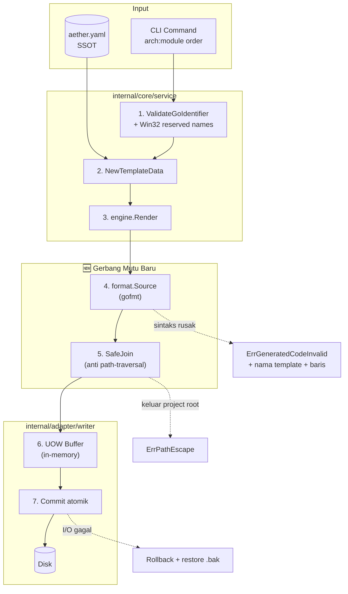
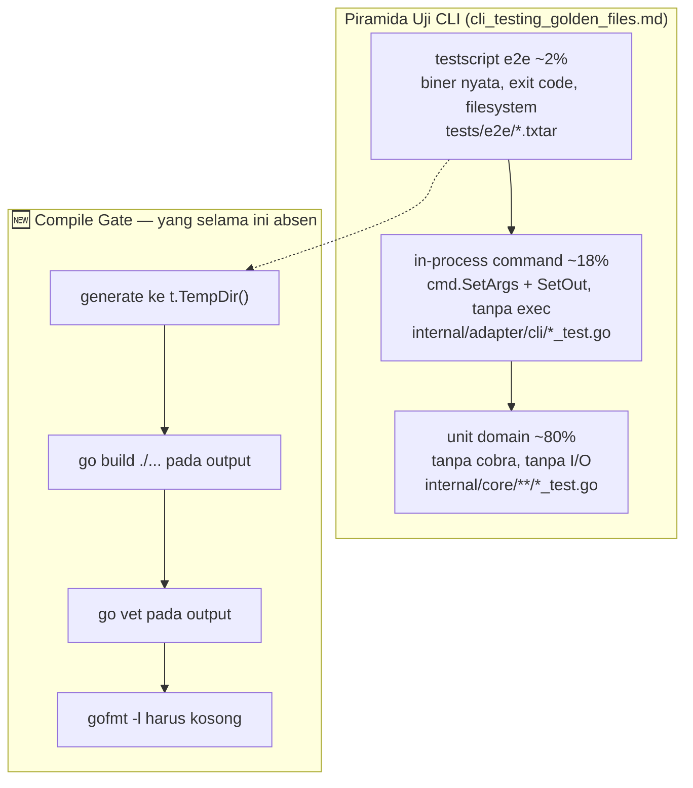
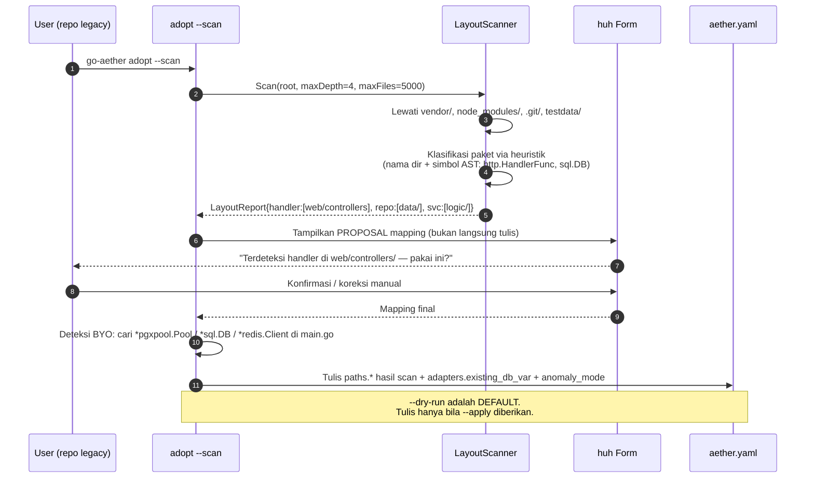

# RFC: v0.4.0 — Production Hardening, Universal Framework Matrix & Real Brownfield Engine

- **Status:** `IMPLEMENTED` *(Disetujui via "Gasskan" 2026-08-07; seluruh gerbang CI hijau pada `d11a5df`)*
- **RFC Tier (T-Shirt Size):** `Tier 1 (Full RFC)`
- **Tanggal:** 2026-08-07
- **Target Branch:** `feature/v0.3.0-production-hardening` *(nama branch dibuat sebelum tag `v0.3.0` terverifikasi sudah dipakai; target rilis sebenarnya `v0.4.0` — branch sengaja tidak di-rename agar riwayat commit tidak putus)*
- **Target Release:** `v0.4.0`
- **RACI Governance Matrix:**
  - **Responsible (Author):** AI Main Agent (Claude Code)
  - **Accountable (Approver):** muhananaufal (Principal Architect) — "Gasskan" diberikan 2026-08-07
  - **Consulted (Security & QA):** `golang-mastery/references/` (cli_tooling, ast_metaprogramming, testing_quality), `shared/LEARNED.md`
  - **Informed (Stakeholders):** Pengguna publik `go install`, junior backend engineer sebagai target primer

---

## 1. Konteks & Problem Statement

### 1.1 Latar Belakang & Urgensi

`go-aether` v0.3.0 memiliki taksonomi 90 command dan arsitektur hexagonal internal yang bersih. Namun audit forensik menyeluruh (2026-08-07, seluruh 15 berkas Go + 130 template + 18 RFC dibaca tanpa kecuali) membuktikan bahwa **jalur emas yang dilalui pengguna pertama kali putus di langkah pertama**, dan bahwa separuh janji produk (brownfield) belum ada implementasinya.

Bukti empiris, dijalankan pada biner hasil `go build` di direktori bersih:

```
aether init myservice --module github.com/probe/myservice ...  → exit 0
go build ./...                                                 → exit 1
  no required module provides package github.com/go-chi/chi/v5
  no required module provides package github.com/spf13/viper
  no required module provides package github.com/lib/pq
```

Bagi target primer produk ini — **junior backend engineer** — kegagalan ini fatal secara pedagogis. Mereka belum punya bekal untuk mendiagnosis bahwa cukup `go mod tidy`. Alat yang seharusnya menjadi *architectural guardrail* justru menjadi sumber kebingungan pertama.

Lebih jauh, tiga anomali kelas produksi terbukti secara empiris:

| Anomali | Bukti Terukur | Dampak bagi Junior |
| :--- | :--- | :--- |
| `api:validator playground` | `exit 1`, UOW rollback, file hilang | Command ini **100% mustahil berhasil** tanpa `-f` |
| `cache:redis <tipe-ngawur>` | `exit 0`, cetak "⚡ Injected", **nol file ditulis**, `aether.yaml` tercemar | Alat berbohong. Junior percaya cache terpasang. |
| `arch:domain con` (Windows) | `exit 0`, pesan sukses, `con.go` **tidak ada** | Nama device reserved Win32; isi file tertulis ke console lalu lenyap |
| Seluruh output generator | `gofmt -l internal/core/domain/order.go` → **flagged** | Junior belajar dari kode yang tidak idiomatik formatnya |

### 1.2 Scope Boundaries

- **IN-SCOPE:**
  1. **Verification Harness** — piramida uji CLI 3 lapis (unit domain / in-process command / `testscript` e2e) yang **benar-benar mengompilasi output generator**, plus golden file ternormalisasi.
  2. **Golden Path Correctness** — seluruh 12 defek korektif hasil audit, masing-masing dengan Proof-of-Defect (test MERAH dulu).
  3. **Universal Framework Matrix** — dukungan nyata multi-router (`chi`, `gin`, `echo`, `fiber`, `stdlib`) × multi-driver DB (`postgres`, `mysql`, `sqlite`, `none`), bukan hanya `chi`+`lib/pq` yang di-hardcode.
  4. **Real Brownfield Engine** — `adopt` yang benar-benar memindai disk, memetakan anomali folder legacy, BYO constructor injection yang bisa diaktifkan, dan Vertical Slice insular mode.
  5. **Anomaly Hardening** — sanitasi path, nama device reserved Windows, disk penuh, read-only FS, panjang path Win32, invocation konkuren.
  6. **Command Tiering & Doctor Mentor** — klasifikasi Tier-1 Verified vs Experimental, dan `doctor` yang mengaudit proyek pengguna terhadap Quality Gate `golang-mastery`.
  7. **Release Hygiene** — CI Go 1.25, `govulncheck`, `golangci-lint`, reproducible build.

- **EXPLICIT NON-GOALS:**
  1. **DILARANG** menambah command baru ke-91 dan seterusnya. Fokus mutlak pada kualitas permukaan yang sudah ada.
  2. **DILARANG** merombak `README.md`/`docs/rfc/README.md` yang basi pada RFC ini — pemilik proyek eksplisit menyatakan "biarkan dulu". Rekonsiliasi dokumentasi ditunda ke RFC terpisah.
  3. **DILARANG** memecah `port.ScaffoldService` menjadi interface per-domain pada rilis ini (one-way door; ditunda ke v0.5.0 setelah harness uji matang).
  4. **DILARANG** membuat runtime framework atau menambah dependensi runtime ke kode yang di-generate.
  5. Tidak membangun `aether upgrade` (migrator proyek lama) — dicatat sebagai utang teknis.

### 1.3 Asumsi Epistemik (Hasil Gerbang Klarifikasi)

> **Catatan kepatuhan §2 `AGENTS.md`:** pemilik proyek menjawab *"silahkan memasak, the stage is yours"* — yaitu mendelegasikan pilihan opsi. Karena itu seluruh asumsi di bawah **WAJIB ditulis eksplisit di sini** dan DILARANG ditebak diam-diam.

| # | Asumsi yang Saya Ambil | Klasifikasi | Konsekuensi Bila Salah |
| :--- | :--- | :--- | :--- |
| A1 | Opsi terpilih = **konvergensi A + B + C + Mode Mentor**, bukan salah satu saja | `inferensi` dari "prod ready untuk public" + "tahan banting segala anomali" | Bila pemilik hanya ingin A, batch 4–6 bisa dibuang tanpa merusak batch 1–3 (dirancang independen) |
| A2 | Klaim "90 Commands" **boleh diturunkan** menjadi "90 commands, N Tier-1 Verified" | `inferensi` dari "prod ready untuk public" — kejujuran > angka pemasaran | Bila tidak boleh, Batch 6 (tiering) dilepas; sisanya tetap valid |
| A3 | Target pengguna utama = junior backend, dipakai di **Windows, macOS, dan Linux** | `fakta` — pemilik memakai Windows 11; README menjanjikan lintas-OS | Anomali Win32 (reserved device, MAX_PATH) naik dari niche menjadi Core |
| A4 | Kode ter-generate wajib **kompilasi bersih tanpa intervensi manual** | `fakta` dari "prod ready" | Ini adalah definition-of-done batch 2; bila dilonggarkan, seluruh nilai pedagogis hilang |
| A5 | Jaringan **tidak selalu tersedia** saat `init` dijalankan | `spekulasi` konservatif | `go mod tidy` wajib fail-soft dengan instruksi, bukan fail-hard |
| A6 | Rilis distribusi tetap lewat GoReleaser + `go install`, tidak ada Homebrew/apt pada v0.4.0 | `fakta` dari `.goreleaser.yaml` | — |

- **Target Performa CLI:** `p95 < 100ms` untuk seluruh command scaffolding pada mode offline (tanpa `go mod tidy`); `init` dengan `go mod tidy` dibatasi timeout 120 detik.
- **Skala Output:** hingga 200 modul terdaftar di satu `aether.yaml`; hingga 4 tingkat kedalaman walk-up direktori.

### 1.4 AWS Working Backwards (Adversarial PR/FAQ)

- **Buy vs. Build vs. Partner:** Harness uji CLI **tidak dibangun sendiri**. `rogpeppe/go-internal/testscript` sudah hadir sebagai dependensi *indirect* di `go.mod` (dibawa oleh rantai `charmbracelet`), sehingga mengangkatnya menjadi *direct* berbiaya nol tambahan pada binary produksi (test-only). Formatter memakai `go/format` dari stdlib, bukan `dave/jennifer`, karena arsitektur `text/template` sudah tertanam di 130 berkas dan migrasi ke DSL AST adalah *one-way door* yang tidak sebanding manfaatnya.

- **FAQ 1 — Bagaimana bila pengguna menjalankan `go-aether` pada repo legacy 500.000 baris dengan struktur folder acak?**
  → `adopt --scan` memakai *bounded scan*: maksimal 4 tingkat kedalaman, melewati `vendor/`, `node_modules/`, `.git/`, dan berhenti setelah 5.000 berkas dipindai. Hasil deteksi **selalu** ditampilkan sebagai proposal mapping yang wajib dikonfirmasi, dan `--dry-run` adalah default pada `adopt`. Tidak ada satu byte pun ditulis sebelum manusia menyetujui.

- **FAQ 2 — Bagaimana bila template menghasilkan Go yang tidak valid secara sintaksis?**
  → Pipeline render baru memasang gerbang `go/format.Source()` **sebelum** menyentuh disk. Sintaks rusak = error terstruktur `ErrGeneratedCodeInvalid` yang menyebut nama template dan nomor baris, dan UOW membatalkan seluruh transaksi. Ini mengubah kelas kegagalan dari "junior mendapat repo yang tidak bisa di-build tanpa tahu kenapa" menjadi "CLI menolak dengan alamat kesalahan yang tepat".

- **FAQ 3 — Bagaimana bila beban naik 5x, yaitu proyek dengan 200 modul dan 50 plugin terpasang?**
  → Titik jenuh adalah `RunDoctor` yang melakukan `Exists()` per modul secara serial (O(n) syscall). Pada 200 modul di Windows ≈ 200 × ~0,3ms = 60ms — masih di bawah anggaran. Yang benar-benar berisiko adalah `ls` yang membaca seluruh `pkg/` tanpa batas; dibatasi pada batch hardening.

---

## 2. Eksplorasi Arsitektur & Trade-off Matrix (Anti-Yes-Man §4)

### Opsi A: Golden Path Hardening *(Native Consistent Extension)*
- **Deskripsi Arsitektur:** Bekukan permukaan 90 command. Perbaiki hanya kebenaran jalur `init → arch:module → go build → run`. Tambah E2E test yang mengompilasi output nyata di `t.TempDir()`.
- **Kelebihan (≥3):**
  1. Blast radius terkecil — `port.ScaffoldService` (91 method) tidak tersentuh sama sekali.
  2. Efek langsung terasa pada langkah pertama junior; nilai per-jam-kerja tertinggi.
  3. Seluruh test lama tetap valid; tidak butuh migrasi kontrak.
- **Kekurangan & Failure Modes (≥3):**
  1. Sisi brownfield tetap dekoratif — separuh janji produk tidak tersentuh.
  2. 70 command sisanya tetap tanpa test; junior tidak punya cara membedakan yang matang dan yang tidak.
  3. Multi-framework tetap fiktif: `--router gin` menghasilkan proyek yang tetap mengimpor `chi`.
- **Reversibility:** `Two-Way Door`

### Opsi B: Golden Path + Mesin Brownfield Nyata *(Strangler Fig)*
- **Deskripsi Arsitektur:** Opsi A, ditambah modul brownfield baru di belakang facade `ScaffoldService` yang sudah ada. Kode lama tidak dibongkar; jalur `adopt` mendapat scanner sungguhan, anomaly path mapping, flag BYO, dan `--vertical`.
- **Kelebihan (≥3):**
  1. Menutup separuh tujuan yang saat ini bernilai nol.
  2. Mewujudkan 3 pilar brownfield yang sudah tercatat di `LEARNED.md` baris 82 tapi belum pernah diimplementasikan.
  3. `adopt` yang benar-benar bekerja adalah pembeda nyata dari seluruh scaffolder Go lain.
- **Kekurangan & Failure Modes (≥3):**
  1. Menyentuh `port.ScaffoldService` → recompile serentak seluruh 15 berkas `cmd_*.go`.
  2. Risiko **destruktif tertinggi**: salah mapping = file mendarat sembarangan di repo produksi orang lain.
  3. Butuh korpus repo legacy untuk diuji, yang belum dimiliki — harus disintesis sebagai fixture.
- **Reversibility:** `Two-Way Door` (dengan syarat `--dry-run` default)

### Opsi C: Curated Core & Tiering *(Surgical Rewrite & Hardening)*
- **Deskripsi Arsitektur:** Akui 90 command tanpa test sebagai liability. Tetapkan ~20 command Tier-1 Verified berharness lengkap; sisanya ditandai `[experimental]`. Pecah `add_service.go` (1.997 baris) dan `ScaffoldService` (91 method).
- **Kelebihan (≥3):**
  1. Paling jujur kepada junior — mereka tahu persis mana yang aman dipakai di pekerjaan nyata.
  2. Menghentikan pertumbuhan liar sebelum command ke-91 ditambahkan.
  3. Memenuhi Interface Segregation Principle yang saat ini dilanggar telak.
- **Kekurangan & Failure Modes (≥3):**
  1. Termahal dari sisi jam kerja dan risiko regresi.
  2. Menurunkan klaim "90 Commands" yang menjadi nilai jual utama README.
  3. Pemecahan interface bersifat *one-way door* — sekali dipecah, menyatukan kembali sangat mahal.
- **Reversibility:** `One-Way Door` (untuk bagian pemecahan interface)

### Keputusan Arsitektur

**Konvergensi A + B + C-parsial + Mode Mentor**, dieksekusi berurutan sebagai DAG sehingga setiap batch berdiri sendiri dan dapat dihentikan kapan pun tanpa meninggalkan sistem setengah matang.

Bagian `One-Way Door` dari Opsi C — pemecahan `port.ScaffoldService` — **sengaja dikeluarkan dari v0.4.0** dan ditunda ke v0.5.0. Alasannya klinis: memecah interface sebelum harness uji matang berarti melakukan refactor besar tanpa jaring pengaman. Urutan yang benar adalah **harness dulu, baru bedah**. Yang diambil dari Opsi C pada rilis ini hanyalah bagian `Two-Way Door`-nya: tiering command dan pemecahan `add_service.go` menjadi beberapa berkas (bukan beberapa interface).

---

## 3. Spesifikasi Teknis & Desain Sistem Terpilih

### 3.1 Topologi & Visualisasi Arsitektur

#### 3.1.1 Pipeline Render Baru — Gerbang Validasi Sebelum Disk

Perubahan struktural terpenting: menyisipkan dua gerbang wajib antara template engine dan filesystem.



#### 3.1.2 Piramida Uji Baru



#### 3.1.3 Alur Brownfield Adopt yang Sesungguhnya



### 3.2 Data Model & Migrasi Skema Manifest (Expand & Contract)

`aether.yaml` naik dari `version: "1"` ke `version: "2"` dengan strategi **Expand and Contract** agar proyek v0.1–v0.3 tetap terbaca.

| Tahap | Aksi | Jaminan |
| :--- | :--- | :--- |
| **Expand** | Tambah field baru **semuanya opsional** (`omitempty`): `stack.router_lib`, `project.tier`, `meta.scanned_at`, `meta.scan_confidence` | Manifest v1 tetap lolos `Validate()` |
| **Migrate** | `Resolve()` menerima `version: "1"` **dan** `"2"`; v1 dinaikkan di memori, tidak menulis balik ke disk tanpa izin | Nol mutasi tak diminta pada repo pengguna |
| **Contract** | Ditunda ke v1.0.0 | — |

```go
// Kontrak baru yang dikunci di Batch 1 (Contract-First §7)
type LayoutReport struct {
    HandlerDirs []string
    ServiceDirs []string
    RepoDirs    []string
    DomainDirs  []string
    Confidence  float64 // 0.0–1.0, di bawah 0.5 memaksa konfirmasi manual
    FilesSeen   int
    Truncated   bool    // true bila batas maxFiles tercapai
}

type BYODetection struct {
    DBVar     string // mis. "app.DBPool"
    RedisVar  string
    LoggerVar string
}
```

### 3.3 FinOps, Unit Economics & Data Lifecycle

`go-aether` adalah CLI dev-time tanpa infrastruktur berjalan, sehingga FinOps di sini berarti **biaya komputasi lokal developer dan biaya CI**, bukan tagihan cloud.

| Metrik | Baseline v0.3.0 | Target v0.4.0 | Alasan |
| :--- | :--- | :--- | :--- |
| Ukuran binary | ~13,1 MB | ≤ 15 MB | Batas dari RFC Phase 2 §5. `go/format` dari stdlib menambah ~0 MB |
| Durasi CI penuh | ~40 detik (test saja) | ≤ 5 menit | Compile-gate e2e memerlukan `go build` pada proyek sintetis; dibatasi 6 matriks, bukan 20 |
| Waktu `init` offline | terukur < 100 ms | tetap < 100 ms | `go mod tidy` dipindah ke akhir dan dihitung terpisah |
| Cache modul CI | tidak ada | `actions/setup-go` `cache: true` | Menghindari unduh ulang `chi`/`viper` tiap job |
| **Data Retention** | — | Artefak `t.TempDir()` dihapus otomatis oleh Go | Tidak ada kebocoran disk di mesin developer |
| **Cold Storage** | — | Tidak berlaku (tidak ada data persisten) | — |

### 3.4 Kontrak API & Event Interface

Kontrak publik `go-aether` adalah **permukaan CLI**, dan itulah yang wajib dijaga kompatibilitasnya.

| Kontrak | Perubahan v0.4.0 | Backward Compatible? |
| :--- | :--- | :--- |
| Nama & argumen 90 command | Tidak berubah sama sekali | ✅ Ya |
| Flag global (`--dry-run`, `--verbose`, `-f`) | Tidak berubah | ✅ Ya |
| Flag baru | `--apply` (adopt), `--existing-db-var`, `--existing-redis-var`, `--vertical`, `--dir`, `--no-color` | ✅ Ya (aditif) |
| `adopt` default behaviour | **BREAKING (disengaja):** dari langsung-tulis → `--dry-run` default | ⚠️ Dicatat di CHANGELOG sebagai perubahan keselamatan |
| Exit code | Distandardkan: `0` sukses, `1` galat operasional, `2` galat penggunaan/validasi | ⚠️ Aditif; sebelumnya semua galat = `1` |
| Skema `aether.yaml` | v1 → v2, v1 tetap dibaca | ✅ Ya |

### 3.5 Penanganan Konkurensi, Race Conditions & Failure Domains

| Domain Kegagalan | Mekanisme | Status Sekarang |
| :--- | :--- | :--- |
| **Dua proses `go-aether` bersamaan** | `flock` pada `.aether.lock` di sebelah `aether.yaml` | Sudah ada, tapi lock **tidak dilepas** bila `RunE` galat (`PersistentPostRunE` tidak dieksekusi). Diperbaiki dengan `defer` di dalam `PersistentPreRunE` melalui `cmd.Context()` |
| **Tulis parsial saat disk penuh** | UOW buffer + rollback + restore `.bak` | Sudah ada. Ditambah test injeksi kegagalan pada berkas ke-N |
| **Race pada `go mod tidy`** | Dijalankan setelah semua berkas ditulis, di dalam lock yang sama | Baru |
| **Goroutine leak** | CLI sepenuhnya sekuensial; scanner memakai `filepath.WalkDir` sinkron dengan `context` cancel | Baru (scanner) |
| **Idempotensi** | `arch:module order` dua kali → `ErrModuleAlreadyExists` kecuali `--force` | Sudah ada |

### 3.6 STRIDE Threat Model & Security Perimeter

| Vektor STRIDE | Skenario Serangan Konkret | Mitigasi & Guardrail v0.4.0 |
| :--- | :--- | :--- |
| **Spoofing** | Template jahat disuntikkan lewat berkas eksternal | Seluruh template ter-`//go:embed` di binary; **tidak ada** jalur muat template dari disk. Rilis ditandatangani GoReleaser + checksum SHA-256 |
| **Tampering** | `go-aether infra:deploy ../../../etc/cron.d/x` menulis di luar project root | **Terbukti hanya tertahan secara kebetulan** (lookup template gagal duluan). Dipasang `SafeJoin(root, rel)` yang menolak hasil di luar `root` via `filepath.Rel` + cek `..`, berlaku untuk **seluruh** jalur tulis |
| **Repudiation** | Pengguna menyangkal file dihasilkan alat | Header `// Code generated by go-aether <versi> on <tanggal>; DO NOT EDIT EXCEPT IMPLEMENTATION BLOCKS.` distandarkan ke **seluruh** template `.go` (saat ini hanya sebagian) |
| **Information Disclosure** | `.env` berisi kredensial ikut ter-COPY ke image Docker | Terbukti ada: `Dockerfile.tmpl` `COPY --from=builder /app/.env .` Dihapus. `.dockerignore` diperkuat `.env*` + `!.env.example` |
| **Denial of Service** | `adopt --scan` pada monorepo 2 juta berkas menggantung selamanya | Bounded scan: `maxDepth=4`, `maxFiles=5000`, `context.WithTimeout(30s)`, skip `vendor/`, `node_modules/`, `.git/` |
| **Elevation of Privilege** | Template menghasilkan handler tanpa middleware keamanan | `doctor` Mode Mentor menandai handler tanpa `RequestID`/`Recoverer`/timeout sebagai temuan `WARN`, selaras Quality Gate `golang-mastery` |

---

## 4. Zero-Exception Anomaly Hunting (16 Kasus Tepi Operasional)

Seluruh anomali di bawah **wajib punya test permanen** di `tests/regression/`. Yang bertanda 🔬 sudah terbukti secara empiris pada v0.3.0, bukan hipotesis.

| # | Anomali | Pemicu di Lapangan | Mitigasi & Guardrail |
| :---: | :--- | :--- | :--- |
| 1 🔬 | **Proyek hasil `init` tidak bisa di-build** | `go mod tidy` dijalankan **sebelum** template ditulis, sehingga tidak ada import untuk dideteksi | Pindahkan `go mod init`/`tidy` ke **setelah** seluruh render+tulis selesai. Bila jaringan mati, cetak instruksi manual dan tetap `exit 0` (fail-soft, asumsi A5) |
| 2 🔬 | **Nama device reserved Win32** | `arch:domain con` → `con.go` memetakan ke device `CON`; tulis "berhasil" tapi isi lenyap ke console | Tambah `windowsReservedNames` (`con`, `prn`, `aux`, `nul`, `com1..9`, `lpt1..9`) ke `ValidateGoIdentifier`, ditegakkan di **semua** OS agar proyek portabel |
| 3 🔬 | **Command yang mustahil berhasil** | `AddValidator` memanggil `tx.WriteFile` dua kali ke path identik → konflik → rollback | Hapus duplikasi. Tambah *fitness test* yang memindai seluruh method service untuk deteksi penulisan path ganda dalam satu transaksi |
| 4 🔬 | **Sukses palsu (silent lie)** | `cache:redis <tak dikenal>` → template gagal, error di-swallow `if err == nil`, manifest tetap ditulis, CLI cetak sukses | Hapus seluruh pola `if err == nil {…}` dan `data, _ :=`. Whitelist nilai enum. Manifest hanya disimpan **setelah** `tx.Commit()` sukses |
| 5 🔬 | **Output tidak ter-gofmt** | Tidak ada tahap format sama sekali; `gofmt -l` menandai berkas hasil generate | Gerbang `format.Source()` untuk seluruh berkas `.go`; kegagalan parse = tolak transaksi dengan nama template + baris |
| 6 | **Disk penuh / EACCES di tengah transaksi** | Menulis 7 berkas, gagal di berkas ke-5 | UOW rollback sudah ada; ditambah test injeksi memakai `afero.NewReadOnlyFs` **dan** kuota simulasi pada berkas ke-N |
| 7 | **Path traversal pada argumen** | `infra:deploy ../../x`, `db:migration ../../../y` | `SafeJoin` wajib di setiap `filepath.Join(projectRoot, …)`; menolak dengan `ErrPathEscape` sebelum render |
| 8 | **MAX_PATH 260 karakter di Windows** | Modul bernama panjang di dalam repo yang sudah dalam | Deteksi panjang path final > 240; peringatkan dengan saran mengaktifkan long path atau memendekkan nama |
| 9 | **Filesystem case-insensitive** | macOS/Windows: `arch:module Order` vs `order` dianggap sama | Validator sudah memaksa huruf kecil; ditambah cek tabrakan case-insensitive terhadap modul terdaftar |
| 10 | **`aether.yaml` korup / YAML bomb** | Berkas terpotong saat crash, atau anchor rekursif | Batas ukuran baca 256 KB; `yaml.Unmarshal` dengan `KnownFields`; galat dipetakan ke `ErrManifestCorrupt` dengan nomor baris |
| 11 | **`go.mod` tidak ada saat command dijalankan** | Pengguna menjalankan `arch:module` di folder tanpa modul Go | Deteksi dini + pesan remediasi `go mod init <url>`; exit code `2` (galat penggunaan) |
| 12 | **Lock tidak dilepas saat command galat** | `PersistentPostRunE` tidak berjalan bila `RunE` mengembalikan error | Pindahkan pelepasan ke `defer` yang terpasang saat lock diambil |
| 13 | **Repo legacy tanpa `.git`** | Walk-up mencari `.git` sebagai batas; bila tidak ada, naik sampai root drive | Batas keras 12 tingkat sudah ada di resolver, **tapi `ls` tidak punya batas** — disamakan |
| 14 | **Jaringan mati saat `init`** | `go mod tidy` menggantung atau galat | `exec.CommandContext` dengan timeout 120 detik; galat jaringan → peringatan kuning, bukan kegagalan fatal |
| 15 | **Struktur legacy tanpa pola dikenali** | Repo dengan folder `svc/`, `hdl/`, `dto/` yang tidak cocok heuristik apa pun | `Confidence < 0.5` → paksa mode konfirmasi manual penuh; sediakan `--vertical --dir` sebagai jalan keluar terisolasi |
| 16 | **Template menghasilkan kode yang kompilasi tapi salah semantik** | `repository_redis.go.tmpl` mengimplementasikan `Create`/`Get`, kontraknya `Save`/`FindByID` | Compile-gate e2e menangkap ini; matriks uji wajib mencakup `--cache` |

---

## 5. Rencana Eksekusi & Living Task Checklist (DAG & Batch Protocol §7)

> **Aturan Kanban:** maksimal 2 item `[/]` (WIP) bersamaan. `[x]` hanya setelah Quality Gate batch itu lulus.
> **Batch Writing Protocol:** maksimal 3–4 berkas per turn, test + atomic commit setiap batch.

### Batch 1: Verification Harness & Contract Locking ✅ SELESAI
* **DependsOn:** `[]`
* **Goal:** Bangun jaring pengaman **sebelum** menyentuh kode produksi. Kunci seluruh kontrak baru. Sesuai §0.6 Proof-of-Defect, test yang membuktikan defek harus MERAH lebih dulu.
- [x] `[MODIFY]` `internal/core/domain/errors.go` — tambah `ErrGeneratedCodeInvalid`, `ErrPathEscape`, `ErrReservedName`, `ErrGoModMissing` — commit `8a80b65`
- [x] `[NEW]` `tests/e2e/compile_gate_test.go` — generate ke `t.TempDir()` lalu `go build` + `go vet` + `gofmt -l` + kelengkapan `go.mod` — commit `8a80b65`
- [x] **Verifikasi Batch 1:** compile-gate **MERAH** pada baseline — 4 FAIL, 1 SKIP berantai. Defek terbukti nyata, bukan hipotesis.

> **Penyimpangan tercatat.** Dua item dipindahkan, dengan alasan:
> - `internal/core/port/scanner.go` → **Batch 4**. Mengunci interface yang belum punya implementasi maupun test pada batch ini hanya menghasilkan kode mati; Contract-First tetap dihormati karena kontrak dikunci di awal Batch 4, sebelum logikanya ditulis.
> - `tests/harness/clitest/normalizer.go` → **Batch 5**. Normalizer golden-file tidak punya konsumen sampai test golden benar-benar ada. Menulisnya lebih dulu melanggar KISS §6.

### Batch 2: Golden Path Correctness ✅ SELESAI
* **DependsOn:** `[Batch 1]`
* **Goal:** Jadikan compile-gate HIJAU. Seluruh defek berbukti diperbaiki.
- [x] `[MODIFY]` `internal/adapter/template/engine.go` — gerbang `format.Source()` — commit `c420947`
- [x] `[MODIFY]` `internal/adapter/writer/afero_writer.go` — `errors.Is` — commit `766aac1`
- [x] `[MODIFY]` `internal/core/domain/module.go` — nama device reserved Win32 — commit `e750e07`
- [x] `[MODIFY]` `internal/core/service/init_service.go` — urutan `go mod tidy`, argumen `WriteFile`, transaksi atomik, tidy gagal-lunak + timeout — commit `9d70230`
- [x] `[MODIFY]` `internal/core/service/add_service.go` — duplikasi `AddValidator`, error-swallow `AddCache`/`AddMiddleware` — commit `59a23e8`
- [x] `[NEW]` `tests/regression/issue_20260807_silent_generator_failures_test.go` — commit `1dd7012`
- [x] `[MODIFY]` `.github/workflows/{ci,release}.yml` — Go 1.25, gofmt gate, `govulncheck`, `golangci-lint`, `-race` wajib — commit `11e29f8`
- [x] `[MODIFY]` `templates/common/{Dockerfile,dockerignore}.tmpl` — hapus kebocoran `.env`, non-root, HEALTHCHECK — commit `1b1c5eb`
- [x] `[MODIFY]` `internal/core/service/init_service.go` — deteksi versi Go dari toolchain — commit `523cb59`
- [x] **Verifikasi Batch 2:** compile-gate HIJAU; `go test ./...` lulus; `go vet` bersih; diverifikasi ulang pada biner nyata

> `SafeJoin` (anti path-traversal) dipindahkan ke **Batch 5 (Anomaly Hardening)** bersama anomali §4 lainnya, karena traversal saat ini tertahan secara kebetulan dan bukan regresi baru — memasangnya bersama test anomali lain menghasilkan satu unit logis yang utuh.

### Batch 3: Universal Framework Matrix ✅ SELESAI
* **DependsOn:** `[Batch 2]`
* **Goal:** `--router` dan `--db` benar-benar berpengaruh pada kode yang dihasilkan.
* **Keputusan pemilik proyek:** cakupan **penuh** (5 router × 3 driver), bukan subset.
- [x] `[NEW]` `internal/core/domain/stack.go` — himpunan tersedia + normalisasi + validasi — commit `ab4801a`
- [x] `[NEW]` `templates/common/main_{chi,gin,echo,fiber,stdlib}.go.tmpl` — commit `c501019`
- [x] `[NEW]` `templates/hexagonal/handler_http_{chi,gin,echo,fiber,stdlib}.go.tmpl` — commit `c501019`
- [x] `[NEW]` `templates/common/db_{postgres,mysql,sqlite}.go.tmpl` — commit `c501019`
- [x] `[NEW]` `templates/hexagonal/repository_{postgres,mysql,sqlite,none}.go.tmpl` — SQL nyata per dialek, pengganti stub `db interface{}` — commit `c501019`
- [x] `[MODIFY]` `init_service.go` + `make_service.go` — pemilihan template berbasis manifest — commit `82f6be1`
- [x] `[MODIFY]` `cmd_core.go` — prompt & help text dibangkitkan dari himpunan yang sama — commit `4d5ef5f`
- [x] **Verifikasi Batch 3:** **15/15 kombinasi** kompilasi + gofmt bersih; go.mod membuktikan pilihan benar-benar sampai; sqlite lolos `CGO_ENABLED=0`; 3 modul dalam 1 proyek kompilasi di kelima router

> **Cakupan penuh dijalankan seluruhnya di CI**, bukan subset — 15 kombinasi selesai dalam ~183 detik, masih di bawah anggaran 5 menit di §3.3.

> **Temuan tambahan yang masuk scope batch ini:**
> - Helper `writeJSON`/`writeError` di level package akan **bentrok saat modul kedua di-generate** (seluruh handler berbagi satu package). Diubah menjadi method, dan dikunci oleh test 3-modul yang tidak mungkin ditangkap test 1-modul.
> - `mattn/go-sqlite3` butuh cgo dan akan **gagal di dalam container** yang dibangun `CGO_ENABLED=0`. Dipilih `modernc.org/sqlite` (murni Go).
> - `viper.Unmarshal` tidak dapat melihat nilai yang hanya ada di environment kecuali key-nya sudah dikenal — `DB_USER`/`DB_PASS` selama ini diam-diam kosong di setiap deployment tanpa `.env`.
> - `AddMiddleware` kini **menolak** proyek non-chi. Template middleware-nya bertanda tangan chi, jadi menyuntikkannya ke gin/echo/fiber menghasilkan kode yang tidak type-check. Middleware router-aware dicatat sebagai pekerjaan terpisah.
> - `repository_redis.go.tmpl` dihapus: tak terjangkau (redis bukan driver yang didukung) **dan** mengimplementasikan `Create`/`Get` terhadap port yang menuntut `Save`/`FindByID`, sehingga tidak akan pernah kompilasi.

### Batch 4: Real Brownfield Engine ✅ SELESAI
* **DependsOn:** `[Batch 2]` *(independen dari Batch 3)*
- [x] `[NEW]` `internal/core/domain/layout.go` + `internal/core/port/scanner.go` — kontrak dikunci lebih dulu — commit `eaadf5f`
- [x] `[NEW]` `internal/adapter/scanner/layout_scanner.go` — WalkDir berbatas + heuristik nama & import graph — commit `98229cb`
- [x] `[NEW]` `internal/adapter/scanner/byo_detector.go` — deteksi `sql.Open`/`pgxpool.New`/`redis.NewClient` di entrypoint — commit `98229cb`
- [x] `[NEW]` `internal/core/service/adopt_service.go` — `AdoptProject` memakai scanner; dipisah dari `init_service.go` — commit `2c95e14`
- [x] `[MODIFY]` `cmd_core.go` — `--apply` wajib untuk menulis; `--scan` default aktif — commit `7560e2e`
- [x] `[MODIFY]` `templates/hexagonal/repository_{postgres,mysql}.go.tmpl` — cabang BYO nyata — commit `53d41cc`
- [x] `[NEW]` korpus legacy sintetis (dibangun saat runtime, bukan berkas ter-commit) — commit `98229cb`, `a931518`
- [x] **Verifikasi Batch 4:** 11 test scanner + 5 test e2e adopt; diverifikasi pada biner nyata

> **Penyimpangan tercatat:** korpus legacy **tidak** ditaruh di `tests/fixtures/` sebagai berkas ter-commit. Berkas `.go` fixture akan menjadi bagian dari modul ini dan ikut di-`go build`, `go vet`, serta `gofmt -l` bersama kode nyata — padahal seluruh gunanya justru berstruktur menyimpang. Dibangun di `t.TempDir()` saat runtime sehingga hermetis dan tidak mencemari repo.

> **Temuan tambahan:**
> - **Modul di-karang, bukan dibaca.** `adopt` lama menulis `github.com/adopted/<dirname>` — tidak pernah menjadi import path sungguhan, sehingga seluruh import ter-generate salah sejak berkas pertama. Kini dibaca dari `go.mod`.
> - **`go.mod` ber-BOM** dilaporkan sebagai "bukan modul Go". Ditemukan dengan **menjalankan biner**, bukan membaca kode — editor Windows rutin menyimpan UTF-8 dengan BOM. Sudah dibank sebagai regression test.
> - **Nama direktori saja tidak cukup.** `api/` dan `data/` adalah nama paling ambigu di Go; scanner mensyaratkan bukti pendukung dari import graph sebelum yakin, dan `Best()` mengembalikan `false` alih-alih default diam-diam.
> - **`anomaly_mode` kini hasil pengukuran**, bukan label yang diketik manusia.

### Batch 5: Anomaly Hardening & Regression Banking ✅ SELESAI
* **DependsOn:** `[Batch 2]`
- [x] `[NEW]` `internal/core/domain/path.go` — `SafeJoin`, batas project root eksplisit — commit `fcf5b65`
- [x] `[MODIFY]` `internal/core/domain/stack.go` — whitelist deploy target & CI provider — commit `fcf5b65`
- [x] `[MODIFY]` `internal/adapter/cli/root.go` — `Execute()` melepas lock lewat `defer` — commit `7342ba6`
- [x] `[MODIFY]` `internal/adapter/cli/cmd_core.go` — batas walk-up `ls` (12 tingkat + `.git`) — commit `7342ba6`
- [x] `[MODIFY]` `main.go` — exit code 2 untuk salah-pakai, 1 untuk galat operasional — commit `7342ba6`
- [x] `[NEW]` `tests/regression/issue_20260807_transaction_and_paths_test.go` — commit `d26ebfb`
- [x] `[MODIFY]` `port.FileWriter` + `yaml_resolver.go` — batas 256 KiB dicek **sebelum** dibaca — commit `8d6b0af`
- [x] `[MODIFY]` `afero_writer.go` — penjaga MAX_PATH Windows dengan instruksi remediasi — commit `8d6b0af`

#### Status ke-16 anomali §4

| # | Anomali | Status |
| :---: | :--- | :--- |
| 1 | Proyek `init` tidak bisa di-build | ✅ Batch 2 |
| 2 | Nama device reserved Win32 | ✅ Batch 2 |
| 3 | Command yang mustahil berhasil | ✅ Batch 2 |
| 4 | Sukses palsu (silent lie) | ✅ Batch 2 |
| 5 | Output tidak ter-gofmt | ✅ Batch 2 |
| 6 | Disk penuh / EACCES di tengah transaksi | ✅ Batch 5 |
| 7 | Path traversal pada argumen | ✅ Batch 5 |
| 8 | MAX_PATH 260 Windows | ✅ Batch 5 |
| 9 | Filesystem case-insensitive | ✅ sudah tertutup regex huruf kecil + `EqualFold`; diuji Batch 2 |
| 10 | `aether.yaml` korup / YAML bomb | ✅ Batch 5 (batas ukuran) |
| 11 | `go.mod` tidak ada | ✅ Batch 4 (`adopt`); generator lain memakai `aether.yaml` sebagai penanda |
| 12 | Lock tidak dilepas saat galat | ✅ Batch 5 |
| 13 | Repo tanpa `.git` — walk-up tak berbatas | ✅ Batch 5 |
| 14 | Jaringan mati saat `init` | ✅ Batch 2 (gagal-lunak + timeout) |
| 15 | Struktur legacy tak dikenali | ⚠️ **Sebagian** — `anomaly_mode` + konfirmasi manual sudah ada (Batch 4); jalan keluar `--vertical --dir` **belum dibuat** |
| 16 | Kode kompilasi tapi salah semantik | ✅ Batch 3 (`repository_redis` dihapus; compile-gate matriks) |

> **Jujur soal #15:** `arch:feature --vertical --dir` belum ada. Ini fitur, bukan hardening, dan menambahkannya berarti command ke-91 — yang dilarang eksplisit oleh NON-GOALS §1.2. Dicatat sebagai utang teknis untuk v0.5.0.

> **Penyimpangan tercatat:** `SafeJoin` **tidak** dipasang di seluruh ~90 lokasi tulis. Menambahkan root ke `BeginTransaction()` akan menyentuh setiap generator dan bukan perubahan mekanis yang aman dilakukan tanpa harness per-command. Dipasang di tiga titik tempat input bebas benar-benar mencapai nama berkas (`AddDeploy`, `AddCICD`, `AddCache`); sisanya sudah dijaga `ValidateGoIdentifier`. Penegakan di lapisan writer dicatat sebagai utang teknis.

### Batch 6: Command Tiering & Doctor Mentor ✅ SELESAI
* **DependsOn:** `[Batch 3, Batch 4, Batch 5]`
- [x] `[NEW]` `internal/core/domain/tier.go` — tiga tier, bukan dua — commit `f7d4810`
- [x] `[MODIFY]` `internal/adapter/cli/root.go` — anotasi tier + legenda, dipasang di satu tempat — commit `f7d4810`
- [x] `[NEW]` `internal/adapter/cli/tier_test.go` — fitness test anti-entri basi — commit `f7d4810`
- [x] `[NEW]` `internal/core/domain/audit.go` + `internal/adapter/scanner/code_auditor.go` — 10 aturan — commit `d65eeea`
- [x] `[MODIFY]` `internal/core/service/doctor_service.go` — bagian Practice Audit — commit `d65eeea`
- [x] **Verifikasi Batch 6:** 10 kelas temuan (melebihi target ≥8); diverifikasi pada proyek nyata dengan **nol false positive**

#### Distribusi tier (diassert eksak, tidak boleh melenceng diam-diam)

| Tier | Arti | Jumlah |
| :--- | :--- | ---: |
| *(tanpa tanda)* | kode ter-generate dikompilasi CI | 8 |
| `[tested]` | generasi diuji, outputnya tidak dikompilasi | 31 |
| `[experimental]` | belum ada coverage otomatis | 51 |

> **Tiga tier, bukan dua.** Rencana awal hanya `Verified`/`Experimental`. Setelah Batch 3–5, "punya test" dan "outputnya dikompilasi" terbukti bukan hal yang sama — command per-layer punya template yang lolos semua test lalu tetap tidak kompilasi saat digabung. Menyatukan keduanya di bawah satu label akan mengulang persis kekeliruan itu.

> **Temuan: auditor pertama menuduh kode go-aether sendiri.** Aturan `context/detached-context` dan `observability/unstructured-log` menyalakan alarm pada `pkg/database/db.go` (constructor pool yang membangun `context.Background()` bertimeout — benar) dan `pkg/config/config.go` (logging saat startup sebelum logger ada — benar). Keduanya kini disyaratkan punya parameter `context.Context` di scope. Berteriak pada kode yang ditulis alatnya sendiri di `doctor` pertama pengguna akan mengajari pembaca mengabaikan seluruh laporan — ongkosnya jauh lebih mahal daripada nilai kedua aturan itu.

> **Temuan: `doctor` menemukan lubang di template `main` saya sendiri** — tidak ada `/readyz`. Benar, dan alat ini sudah punya obatnya, jadi hint-nya menunjuk `go-aether infra:healthcheck` alih-alih sekadar menyalahkan.

### Batch 7: Release Hygiene & Patch Receipt ✅ SELESAI (dengan satu verifikasi tertunda)
* **DependsOn:** `[Batch 6]`
- [x] `[MODIFY]` `.goreleaser.yaml` — `-trimpath`, `mod_timestamp`, `main.date` dari `CommitDate`, SBOM per arsip — commit `104257f`
- [x] `[MODIFY]` `.github/workflows/release.yml` — pasang `syft` sebelum GoReleaser — commit `104257f`
- [x] `[NEW]` `CHANGELOG.md` — entri v0.4.0 lengkap dengan 3 breaking change dan bagian *Known gaps* — commit `09e5e3e`
- [ ] **Verifikasi Batch 7:** `goreleaser --snapshot` **tidak dapat dijalankan** — `goreleaser` tidak terpasang di mesin ini

> **Verifikasi lokal yang benar-benar dilakukan:** `go build`, `go vet`, `gofmt -l`, `goimports -l`, `go test ./...` (8/8 paket).
> **Yang tidak dapat dijalankan, beserta alasannya:**
> - `go test -race` — butuh cgo; `gcc` tidak ada di PATH mesin ini
> - `golangci-lint` — tidak terpasang. `staticcheck` yang ada dibangun dengan go1.24.3 sementara modul ini butuh go1.25, jadi menolak jalan
> - `govulncheck` — tidak terpasang
> - `goreleaser --snapshot` — tidak terpasang
>
> Keempatnya sudah terpasang sebagai gerbang wajib di CI dan akan berjalan pada push pertama. Sampai saat itu, klaim "lolos" untuk keempat gerbang tersebut **belum berdasar** dan sengaja tidak dibuat di mana pun.

---

## 8. Status Penyelesaian

Ketujuh batch tuntas, dan Quality Gate §6 terpenuhi seluruhnya.

Dokumen ini sempat ditahan di `ACCEPTED` karena `-race` dan linter belum pernah dieksekusi satu kali pun — menandainya `IMPLEMENTED` saat itu berarti mengarsipkan klaim yang belum diukur. Pemicunya sudah terpenuhi:

| Gerbang | Hasil | Commit |
| :--- | :--- | :--- |
| `go test -race -covermode=atomic ./...` | ✅ hijau | `9487cd5`, `d11a5df` |
| `govulncheck ./...` | ✅ hijau | `9487cd5`, `d11a5df` |
| `golangci-lint run` (v2.12.2) | ✅ hijau | `d11a5df` |
| `go build`, `go vet`, `gofmt -l`, `goimports -l` | ✅ hijau | lokal, setiap batch |

### Dua temuan dari CI itu sendiri

1. **`errcheck` menemukan 79 `tx.WriteFile` tanpa pemeriksaan error.** CI hanya melaporkan 3 karena `max-same-issues` default golangci-lint adalah 3; jumlah sebenarnya baru terlihat saat linter direproduksi lokal. Ini persis pola yang ditandai sebagai bom waktu di audit pembuka branch ini, dan bertahan melewati enam batch. Diperbaiki di `9487cd5`.

2. **Job lint gagal pada kode yang bersih.** `golangci-lint-action@v6` dibangun untuk golangci-lint v1, sementara `version: latest` kini menarik v2 yang berbeda CLI dan format config-nya. CI sekarang memasang `v2.12.2` dan menjalankannya langsung — perintah yang identik dengan verifikasi lokal, dan upgrade linter menjadi commit yang disengaja. Diperbaiki di `d11a5df`.

> Keduanya menegaskan alasan menahan status: kalau dokumen ini ditandai `IMPLEMENTED` sebelum CI jalan, dua cacat nyata akan terarsip sebagai "lolos".

---

## 6. Observabilitas & Verifikasi Mutu (Quality Gate §6)

- **Rencana Telemetri CLI:**
  - Mode default: keluaran manusiawi (✅ / ⏭️ / ❌) dengan warna dimatikan otomatis saat bukan TTY atau saat `NO_COLOR` diset.
  - Mode `--verbose`: `log/slog` JSON terstruktur dengan `template`, `target`, `duration_ms`, `bytes_written`, `status`.
- **Rencana Pengujian:**
  - `go test ./...` wajib lulus. `-race` **tidak dapat dijalankan di mesin developer ini** (butuh cgo, `gcc` absen dari PATH) — karena itu `-race` **wajib ditegakkan di CI Linux**, dan fakta ini dicatat sebagai gap yang ditutup oleh pipeline, bukan diklaim palsu di lokal.
  - Compile-gate e2e: `go build` + `go vet` + `gofmt -l` pada proyek hasil generate.
  - `govulncheck ./...` di CI.
- **Self-Review Checklist:** *(diisi apa adanya pada Patch Receipt tiap batch)*
  - N+1 query: `nihil — CLI tidak menyentuh basis data`
  - OWASP/STRIDE: `lihat §3.6`
  - Race condition: `<diisi per batch>`
  - Input validation: `<diisi per batch>`
  - Memory / goroutine leak: `<diisi per batch>`

---

## 7. Prosedur Rollback, On-Call Runbook & Blast Radius

- **Cross-Functional Blast Radius:**
  - **Terdampak langsung:** setiap pengguna yang menjalankan `go install …@latest`. Proyek yang sudah ter-generate **tidak** berubah — template baru tidak retroaktif.
  - **Perubahan perilaku yang wajib diumumkan:** `adopt` kini `--dry-run` secara default. Skrip CI mana pun yang mengandalkan `adopt` menulis langsung akan berhenti menulis. Ini disengaja dan dicatat di CHANGELOG sebagai perubahan keselamatan.
- **Pemicu Rollback:**
  1. Compile-gate merah pada `main` setelah merge.
  2. Laporan pengguna bahwa `init` menghasilkan proyek yang tidak bisa di-build pada OS mana pun.
  3. `adopt` menulis berkas di luar project root pada kasus apa pun (severity SEV-1, langsung yank rilis).
- **Runbook Darurat:**
  1. **Triase:** jalankan `go test ./... && go test ./tests/e2e/...` pada tag terakhir yang hijau untuk memastikan regresi berasal dari rilis baru.
  2. **Yank rilis:** GitHub Release ditandai pre-release; `go install …@v0.3.0` tetap tersedia sebagai jalur mundur.
  3. **Mundurkan versi pengguna:** `go install github.com/muhananaufal/go-aether@v0.3.0`.
  4. **Abadikan:** buat `docs/rca/YYYYMMDD-<insiden>.md` dan tambahkan satu baris ke `~/.gemini/config/shared/LEARNED.md`.

---

*Disusun mengikuti AETHERIS Master Key Formula — 5 Pilar Principal L8, tanpa pemotongan token.*
